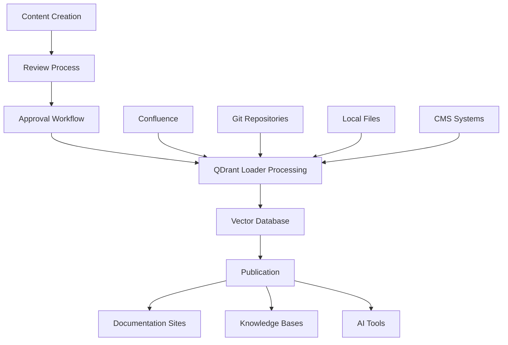

# Content Management Workflow

This comprehensive guide shows how to implement streamlined content management workflows for documentation teams, content creators, and knowledge managers. Whether you're managing a documentation site, internal knowledge base, or content publishing pipeline, this workflow provides practical solutions for content creation, review, publishing, and maintenance.

## 🎯 Overview

The content management workflow focuses on creating efficient processes for content lifecycle management, from initial creation through publication and ongoing maintenance. This workflow is essential for organizations that need to maintain high-quality, up-to-date content across multiple sources and formats.

### Workflow Benefits

```
📝 Streamlined Publishing  - Efficient content creation to publication
🔍 Quality Control        - Automated review and validation processes
🔄 Content Synchronization - Multi-source content coordination
📊 Analytics & Insights    - Content performance and usage tracking
🤝 Collaborative Editing  - Team-based content development
```

## 🏗️ Architecture Overview



## 📋 Prerequisites

### Required Tools

- **Content Management System** (Confluence, Notion, etc.)
- **Version Control** (Git for documentation)
- **QDrant instance** (local or cloud)
- **OpenAI API key** for embeddings
- **CI/CD platform** for automation

### Content Sources

```
📚 Documentation Sites   - Static site generators, wikis
🏢 Enterprise CMS       - Confluence, SharePoint, Notion
📁 File Systems         - Markdown, Word docs, PDFs
🔗 External Sources     - APIs, databases, third-party docs
```

## 🚀 Step-by-Step Implementation

### Step 1: Content Source Configuration

#### 1.1 Multi-Source Setup

```yaml
# qdrant-loader.yaml
qdrant:
  url: "${QDRANT_URL}"
  api_key: "${QDRANT_API_KEY}"
  collection_name: "content_hub"

openai:
  api_key: "${OPENAI_API_KEY}"
  model: "text-embedding-3-small"

data_sources:
  confluence:
    base_url: "${CONFLUENCE_URL}"
    username: "${CONFLUENCE_USERNAME}"
    api_token: "${CONFLUENCE_API_TOKEN}"
    spaces:
      - "DOCS"      # Documentation space
      - "KB"        # Knowledge base
      - "PROC"      # Procedures
    include_attachments: true
    page_filters:
      - status: "current"
      - labels: ["published", "approved"]
    
  git:
    repositories:
      - url: "https://github.com/company/documentation"
        branch: "main"
        include_patterns:
          - "content/**/*.md"
          - "docs/**/*.md"
          - "guides/**/*.md"
        exclude_patterns:
          - "drafts/"
          - "*.draft.md"
    
  local:
    paths:
      - path: "/content/published"
        recursive: true
        include_patterns:
          - "*.md"
          - "*.pdf"
          - "*.docx"
        exclude_patterns:
          - "*.tmp"
          - "~*"

processing:
  chunk_size: 1200
  chunk_overlap: 300
  extract_metadata: true
  content_validation: true
  duplicate_detection: true

workflow:
  content_review:
    enabled: true
    reviewers: ["content-team@company.com"]
    approval_required: true
  
  publishing:
    auto_publish: false
    staging_collection: "content_staging"
    production_collection: "content_production"
```

#### 1.2 Content Metadata Standards

```yaml
# Content metadata schema
metadata_schema:
  required_fields:
    - title
    - author
    - created_date
    - content_type
    - status
  
  optional_fields:
    - tags
    - category
    - audience
    - review_date
    - expiry_date
    - version
  
  content_types:
    - "guide"
    - "tutorial"
    - "reference"
    - "faq"
    - "policy"
    - "procedure"
  
  status_values:
    - "draft"
    - "review"
    - "approved"
    - "published"
    - "archived"
```

### Step 2: Content Creation Workflow

#### 2.1 Content Templates

```markdown
<!-- content-template.md -->
---
title: "Content Title"
author: "Author Name"
created_date: "2024-01-15"
content_type: "guide"
status: "draft"
tags: ["tag1", "tag2"]
category: "documentation"
audience: "developers"
review_date: "2024-02-15"
---

# Content Title

## Overview

Brief description of the content and its purpose.

## Prerequisites

- Requirement 1
- Requirement 2

## Main Content

### Section 1

Content here...

### Section 2

Content here...

## Examples

```bash
# Code examples
command --option value
```

## Related Content

- [Related Guide 1](link)
- [Related Guide 2](link)

## Feedback

For questions or feedback, contact [team@company.com](mailto:team@company.com).

---

**Last Updated**: 2024-01-15  
**Next Review**: 2024-02-15

```

#### 2.2 Content Creation Scripts

```bash
#!/bin/bash
# scripts/create-content.sh - Content creation helper

set -euo pipefail

CONTENT_DIR="${CONTENT_DIR:-./content}"
TEMPLATE_DIR="${TEMPLATE_DIR:-./templates}"

# Function to create new content
create_content() {
    local content_type="$1"
    local title="$2"
    local author="${3:-$(git config user.name)}"
    
    # Sanitize title for filename
    local filename=$(echo "$title" | tr '[:upper:]' '[:lower:]' | sed 's/[^a-z0-9]/-/g' | sed 's/--*/-/g' | sed 's/^-\|-$//g')
    local filepath="$CONTENT_DIR/$content_type/$filename.md"
    
    # Create directory if it doesn't exist
    mkdir -p "$(dirname "$filepath")"
    
    # Copy template and customize
    if [ -f "$TEMPLATE_DIR/$content_type-template.md" ]; then
        cp "$TEMPLATE_DIR/$content_type-template.md" "$filepath"
    else
        cp "$TEMPLATE_DIR/default-template.md" "$filepath"
    fi
    
    # Replace placeholders
    sed -i "s/{{TITLE}}/$title/g" "$filepath"
    sed -i "s/{{AUTHOR}}/$author/g" "$filepath"
    sed -i "s/{{DATE}}/$(date +%Y-%m-%d)/g" "$filepath"
    sed -i "s/{{TYPE}}/$content_type/g" "$filepath"
    
    echo "Created new $content_type: $filepath"
    echo "Next steps:"
    echo "1. Edit the content: $filepath"
    echo "2. Submit for review: ./scripts/submit-review.sh $filepath"
    echo "3. Publish: ./scripts/publish-content.sh $filepath"
}

# Function to list content templates
list_templates() {
    echo "Available content templates:"
    for template in "$TEMPLATE_DIR"/*-template.md; do
        if [ -f "$template" ]; then
            local type=$(basename "$template" -template.md)
            echo "  - $type"
        fi
    done
}

# Main function
main() {
    local command="${1:-help}"
    
    case "$command" in
        create)
            if [ $# -lt 3 ]; then
                echo "Usage: $0 create <type> <title> [author]"
                echo "Example: $0 create guide 'Getting Started with API' 'John Doe'"
                exit 1
            fi
            create_content "$2" "$3" "${4:-}"
            ;;
        list)
            list_templates
            ;;
        help|*)
            echo "Content Creation Helper"
            echo ""
            echo "Commands:"
            echo "  create <type> <title> [author]  - Create new content"
            echo "  list                            - List available templates"
            echo "  help                            - Show this help"
            ;;
    esac
}

main "$@"
```

### Step 3: Review and Approval Process

#### 3.1 Content Review Workflow

```bash
#!/bin/bash
# scripts/review-workflow.sh - Content review automation

set -euo pipefail

REVIEW_DIR="${REVIEW_DIR:-./review}"
APPROVED_DIR="${APPROVED_DIR:-./approved}"
CONFIG_FILE="${CONFIG_FILE:-./qdrant-loader.yaml}"

# Function to submit content for review
submit_for_review() {
    local filepath="$1"
    local reviewer="${2:-content-team@company.com}"
    
    if [ ! -f "$filepath" ]; then
        echo "Error: File not found: $filepath"
        exit 1
    fi
    
    # Extract metadata
    local title=$(grep "^title:" "$filepath" | cut -d'"' -f2)
    local author=$(grep "^author:" "$filepath" | cut -d'"' -f2)
    
    # Move to review directory
    local review_file="$REVIEW_DIR/$(basename "$filepath")"
    cp "$filepath" "$review_file"
    
    # Update status to review
    sed -i 's/status: "draft"/status: "review"/' "$review_file"
    
    # Create review request
    cat > "$REVIEW_DIR/$(basename "$filepath" .md).review" << EOF
{
  "title": "$title",
  "author": "$author",
  "filepath": "$review_file",
  "reviewer": "$reviewer",
  "submitted_date": "$(date -u +%Y-%m-%dT%H:%M:%SZ)",
  "status": "pending"
}
EOF
    
    echo "Content submitted for review:"
    echo "  Title: $title"
    echo "  Author: $author"
    echo "  Reviewer: $reviewer"
    echo "  File: $review_file"
    
    # Send notification (if configured)
    if command -v mail >/dev/null 2>&1; then
        echo "New content ready for review: $title" | mail -s "Content Review Request" "$reviewer"
    fi
}

# Function to approve content
approve_content() {
    local review_file="$1"
    local approver="${2:-$(git config user.email)}"
    
    if [ ! -f "$review_file" ]; then
        echo "Error: Review file not found: $review_file"
        exit 1
    fi
    
    # Move to approved directory
    local approved_file="$APPROVED_DIR/$(basename "$review_file")"
    cp "$review_file" "$approved_file"
    
    # Update status to approved
    sed -i 's/status: "review"/status: "approved"/' "$approved_file"
    
    # Add approval metadata
    cat >> "$approved_file" << EOF

<!-- Approval Information -->
<!-- Approved by: $approver -->
<!-- Approved date: $(date -u +%Y-%m-%dT%H:%M:%SZ) -->
EOF
    
    # Update review record
    local review_record="$REVIEW_DIR/$(basename "$review_file" .md).review"
    if [ -f "$review_record" ]; then
        jq --arg approver "$approver" --arg date "$(date -u +%Y-%m-%dT%H:%M:%SZ)" \
           '.status = "approved" | .approver = $approver | .approved_date = $date' \
           "$review_record" > "$review_record.tmp" && mv "$review_record.tmp" "$review_record"
    fi
    
    echo "Content approved: $approved_file"
    echo "Ready for publication"
}

# Function to reject content
reject_content() {
    local review_file="$1"
    local reason="$2"
    local reviewer="${3:-$(git config user.email)}"
    
    # Update review record
    local review_record="$REVIEW_DIR/$(basename "$review_file" .md).review"
    if [ -f "$review_record" ]; then
        jq --arg reviewer "$reviewer" --arg date "$(date -u +%Y-%m-%dT%H:%M:%SZ)" --arg reason "$reason" \
           '.status = "rejected" | .reviewer = $reviewer | .rejected_date = $date | .rejection_reason = $reason' \
           "$review_record" > "$review_record.tmp" && mv "$review_record.tmp" "$review_record"
    fi
    
    echo "Content rejected: $review_file"
    echo "Reason: $reason"
}

# Main function
main() {
    local command="${1:-help}"
    
    case "$command" in
        submit)
            if [ $# -lt 2 ]; then
                echo "Usage: $0 submit <filepath> [reviewer]"
                exit 1
            fi
            submit_for_review "$2" "${3:-}"
            ;;
        approve)
            if [ $# -lt 2 ]; then
                echo "Usage: $0 approve <review_filepath> [approver]"
                exit 1
            fi
            approve_content "$2" "${3:-}"
            ;;
        reject)
            if [ $# -lt 3 ]; then
                echo "Usage: $0 reject <review_filepath> <reason> [reviewer]"
                exit 1
            fi
            reject_content "$2" "$3" "${4:-}"
            ;;
        list)
            echo "Pending reviews:"
            for review in "$REVIEW_DIR"/*.review; do
                if [ -f "$review" ]; then
                    local title=$(jq -r '.title' "$review")
                    local status=$(jq -r '.status' "$review")
                    echo "  - $title ($status)"
                fi
            done
            ;;
        help|*)
            echo "Content Review Workflow"
            echo ""
            echo "Commands:"
            echo "  submit <file> [reviewer]     - Submit content for review"
            echo "  approve <review_file>        - Approve content"
            echo "  reject <review_file> <reason> - Reject content"
            echo "  list                         - List pending reviews"
            echo "  help                         - Show this help"
            ;;
    esac
}

main "$@"
```

#### 3.2 Automated Quality Checks

```bash
#!/bin/bash
# scripts/quality-check.sh - Automated content quality validation

set -euo pipefail

# Function to check content quality
check_content_quality() {
    local filepath="$1"
    local errors=()
    local warnings=()
    
    echo "Checking content quality: $filepath"
    
    # Check file exists
    if [ ! -f "$filepath" ]; then
        errors+=("File not found: $filepath")
        return 1
    fi
    
    # Check required metadata
    if ! grep -q "^title:" "$filepath"; then
        errors+=("Missing required field: title")
    fi
    
    if ! grep -q "^author:" "$filepath"; then
        errors+=("Missing required field: author")
    fi
    
    if ! grep -q "^content_type:" "$filepath"; then
        errors+=("Missing required field: content_type")
    fi
    
    # Check content length
    local word_count=$(wc -w < "$filepath")
    if [ "$word_count" -lt 100 ]; then
        warnings+=("Content is very short ($word_count words)")
    fi
    
    # Check for broken links (basic check)
    if grep -q "](http" "$filepath"; then
        while IFS= read -r line; do
            if echo "$line" | grep -q "](http"; then
                local url=$(echo "$line" | sed -n 's/.*](\(http[^)]*\)).*/\1/p')
                if [ -n "$url" ]; then
                    if ! curl -s --head "$url" | head -n 1 | grep -q "200 OK"; then
                        warnings+=("Potentially broken link: $url")
                    fi
                fi
            fi
        done < "$filepath"
    fi
    
    # Check spelling (if aspell is available)
    if command -v aspell >/dev/null 2>&1; then
        local misspelled=$(aspell list < "$filepath" | sort -u | head -5)
        if [ -n "$misspelled" ]; then
            warnings+=("Potential spelling issues: $(echo "$misspelled" | tr '\n' ' ')")
        fi
    fi
    
    # Report results
    if [ ${#errors[@]} -gt 0 ]; then
        echo "❌ Quality check failed:"
        for error in "${errors[@]}"; do
            echo "  ERROR: $error"
        done
        return 1
    fi
    
    if [ ${#warnings[@]} -gt 0 ]; then
        echo "⚠️  Quality check passed with warnings:"
        for warning in "${warnings[@]}"; do
            echo "  WARNING: $warning"
        done
    else
        echo "✅ Quality check passed"
    fi
    
    return 0
}

# Function to validate all content in directory
validate_directory() {
    local directory="$1"
    local failed_files=()
    
    echo "Validating all content in: $directory"
    
    find "$directory" -name "*.md" -type f | while read -r file; do
        if ! check_content_quality "$file"; then
            failed_files+=("$file")
        fi
    done
    
    if [ ${#failed_files[@]} -gt 0 ]; then
        echo ""
        echo "Files that failed quality check:"
        for file in "${failed_files[@]}"; do
            echo "  - $file"
        done
        return 1
    fi
    
    echo ""
    echo "All files passed quality check ✅"
    return 0
}

# Main function
main() {
    local command="${1:-help}"
    
    case "$command" in
        file)
            if [ $# -lt 2 ]; then
                echo "Usage: $0 file <filepath>"
                exit 1
            fi
            check_content_quality "$2"
            ;;
        directory)
            if [ $# -lt 2 ]; then
                echo "Usage: $0 directory <directory_path>"
                exit 1
            fi
            validate_directory "$2"
            ;;
        help|*)
            echo "Content Quality Checker"
            echo ""
            echo "Commands:"
            echo "  file <filepath>        - Check single file"
            echo "  directory <path>       - Check all files in directory"
            echo "  help                   - Show this help"
            ;;
    esac
}

main "$@"
```

### Step 4: Publishing Pipeline

#### 4.1 Staging and Production Pipeline

```bash
#!/bin/bash
# scripts/publishing-pipeline.sh - Content publishing automation

set -euo pipefail

CONFIG_FILE="${CONFIG_FILE:-./qdrant-loader.yaml}"
STAGING_COLLECTION="content_staging"
PRODUCTION_COLLECTION="content_production"

# Function to publish to staging
publish_to_staging() {
    local content_path="$1"
    
    echo "Publishing to staging environment..."
    
    # Load content to staging collection
    qdrant-loader load \
        --source local \
        --path "$content_path" \
        --collection "$STAGING_COLLECTION" \
        --config "$CONFIG_FILE"
    
    # Verify staging deployment
    local staging_count=$(qdrant-loader status \
        --collection "$STAGING_COLLECTION" \
        --output json | jq -r '.vector_count')
    
    echo "Staging deployment complete: $staging_count documents"
    
    # Run staging tests
    run_staging_tests
}

# Function to run staging tests
run_staging_tests() {
    echo "Running staging tests..."
    
    local test_queries=(
        "getting started"
        "API documentation"
        "troubleshooting"
    )
    
    for query in "${test_queries[@]}"; do
        echo "Testing search: $query"
        local results=$(qdrant-loader search "$query" \
            --collection "$STAGING_COLLECTION" \
            --limit 3 \
            --output json)
        
        local result_count=$(echo "$results" | jq 'length')
        if [ "$result_count" -eq 0 ]; then
            echo "❌ No results for query: $query"
            return 1
        else
            echo "✅ Found $result_count results for: $query"
        fi
    done
    
    echo "All staging tests passed ✅"
}

# Function to promote to production
promote_to_production() {
    echo "Promoting content to production..."
    
    # Backup current production
    echo "Creating production backup..."
    qdrant-loader backup \
        --collection "$PRODUCTION_COLLECTION" \
        --output "production-backup-$(date +%Y%m%d-%H%M%S).tar.gz"
    
    # Copy staging to production
    echo "Copying staging content to production..."
    qdrant-loader collection copy \
        "$STAGING_COLLECTION" \
        "$PRODUCTION_COLLECTION"
    
    # Verify production deployment
    local production_count=$(qdrant-loader status \
        --collection "$PRODUCTION_COLLECTION" \
        --output json | jq -r '.vector_count')
    
    echo "Production deployment complete: $production_count documents"
    
    # Run production smoke tests
    run_production_tests
}

# Function to run production tests
run_production_tests() {
    echo "Running production smoke tests..."
    
    # Test search functionality
    local test_result=$(qdrant-loader search "test query" \
        --collection "$PRODUCTION_COLLECTION" \
        --limit 1 \
        --timeout 5)
    
    if [ $? -eq 0 ]; then
        echo "✅ Production search test passed"
    else
        echo "❌ Production search test failed"
        return 1
    fi
    
    # Test MCP server connectivity
    if qdrant-loader mcp-server status --quiet; then
        echo "✅ MCP server connectivity test passed"
    else
        echo "❌ MCP server connectivity test failed"
        return 1
    fi
    
    echo "All production tests passed ✅"
}

# Function to rollback production
rollback_production() {
    local backup_file="$1"
    
    echo "Rolling back production to backup: $backup_file"
    
    if [ ! -f "$backup_file" ]; then
        echo "❌ Backup file not found: $backup_file"
        return 1
    fi
    
    # Restore from backup
    qdrant-loader collection restore \
        --input "$backup_file" \
        --collection "$PRODUCTION_COLLECTION" \
        --force
    
    echo "✅ Production rollback completed"
}

# Main function
main() {
    local command="${1:-help}"
    
    case "$command" in
        staging)
            if [ $# -lt 2 ]; then
                echo "Usage: $0 staging <content_path>"
                exit 1
            fi
            publish_to_staging "$2"
            ;;
        production)
            promote_to_production
            ;;
        rollback)
            if [ $# -lt 2 ]; then
                echo "Usage: $0 rollback <backup_file>"
                exit 1
            fi
            rollback_production "$2"
            ;;
        test-staging)
            run_staging_tests
            ;;
        test-production)
            run_production_tests
            ;;
        help|*)
            echo "Content Publishing Pipeline"
            echo ""
            echo "Commands:"
            echo "  staging <path>         - Publish to staging"
            echo "  production             - Promote staging to production"
            echo "  rollback <backup>      - Rollback production"
            echo "  test-staging           - Test staging environment"
            echo "  test-production        - Test production environment"
            echo "  help                   - Show this help"
            ;;
    esac
}

main "$@"
```

#### 4.2 CI/CD Integration

```yaml
# .github/workflows/content-pipeline.yml
name: Content Management Pipeline

on:
  push:
    branches: [main]
    paths: ['content/**', 'approved/**']
  pull_request:
    branches: [main]
    paths: ['content/**']
  workflow_dispatch:
    inputs:
      environment:
        description: 'Deployment environment'
        required: true
        default: 'staging'
        type: choice
        options:
          - staging
          - production

jobs:
  quality-check:
    runs-on: ubuntu-latest
    steps:
    - name: Checkout repository
      uses: actions/checkout@v4
    
    - name: Setup Python
      uses: actions/setup-python@v4
      with:
        python-version: '3.11'
    
    - name: Install dependencies
      run: |
        pip install qdrant-loader
        sudo apt-get install -y aspell
    
    - name: Run quality checks
      run: |
        ./scripts/quality-check.sh directory ./content
        ./scripts/quality-check.sh directory ./approved
    
    - name: Validate configuration
      run: |
        qdrant-loader config validate

  deploy-staging:
    needs: quality-check
    runs-on: ubuntu-latest
    if: github.ref == 'refs/heads/main'
    environment: staging
    
    steps:
    - name: Checkout repository
      uses: actions/checkout@v4
    
    - name: Setup Python
      uses: actions/setup-python@v4
      with:
        python-version: '3.11'
    
    - name: Install QDrant Loader
      run: pip install qdrant-loader
    
    - name: Deploy to staging
      env:
        QDRANT_URL: ${{ secrets.QDRANT_STAGING_URL }}
        QDRANT_API_KEY: ${{ secrets.QDRANT_STAGING_API_KEY }}
        OPENAI_API_KEY: ${{ secrets.OPENAI_API_KEY }}
      run: |
        ./scripts/publishing-pipeline.sh staging ./approved
    
    - name: Test staging deployment
      env:
        QDRANT_URL: ${{ secrets.QDRANT_STAGING_URL }}
        QDRANT_API_KEY: ${{ secrets.QDRANT_STAGING_API_KEY }}
        OPENAI_API_KEY: ${{ secrets.OPENAI_API_KEY }}
      run: |
        ./scripts/publishing-pipeline.sh test-staging

  deploy-production:
    needs: deploy-staging
    runs-on: ubuntu-latest
    if: github.event.inputs.environment == 'production' || (github.ref == 'refs/heads/main' && github.event_name == 'workflow_dispatch')
    environment: production
    
    steps:
    - name: Checkout repository
      uses: actions/checkout@v4
    
    - name: Setup Python
      uses: actions/setup-python@v4
      with:
        python-version: '3.11'
    
    - name: Install QDrant Loader
      run: pip install qdrant-loader
    
    - name: Deploy to production
      env:
        QDRANT_URL: ${{ secrets.QDRANT_PROD_URL }}
        QDRANT_API_KEY: ${{ secrets.QDRANT_PROD_API_KEY }}
        OPENAI_API_KEY: ${{ secrets.OPENAI_API_KEY }}
      run: |
        ./scripts/publishing-pipeline.sh production
    
    - name: Test production deployment
      env:
        QDRANT_URL: ${{ secrets.QDRANT_PROD_URL }}
        QDRANT_API_KEY: ${{ secrets.QDRANT_PROD_API_KEY }}
        OPENAI_API_KEY: ${{ secrets.OPENAI_API_KEY }}
      run: |
        ./scripts/publishing-pipeline.sh test-production
    
    - name: Notify deployment
      uses: 8398a7/action-slack@v3
      with:
        status: success
        webhook_url: ${{ secrets.SLACK_WEBHOOK }}
        text: "Content successfully deployed to production"
```

### Step 5: Content Curation and Maintenance

#### 5.1 Content Analytics and Insights

```bash
#!/bin/bash
# scripts/content-analytics.sh - Content performance analytics

set -euo pipefail

CONFIG_FILE="${CONFIG_FILE:-./qdrant-loader.yaml}"
ANALYTICS_DIR="${ANALYTICS_DIR:-./analytics}"

# Function to generate content analytics
generate_analytics() {
    local collection="${1:-content_production}"
    local output_file="$ANALYTICS_DIR/content-analytics-$(date +%Y%m%d).json"
    
    echo "Generating content analytics for collection: $collection"
    
    mkdir -p "$ANALYTICS_DIR"
    
    # Get collection statistics
    local collection_stats=$(qdrant-loader status \
        --collection "$collection" \
        --stats \
        --output json)
    
    # Get recent activity
    local recent_activity=$(qdrant-loader status \
        --recent \
        --limit 50 \
        --output json)
    
    # Search performance metrics
    local search_metrics=$(qdrant-loader metrics \
        --metric search_latency,search_count \
        --output json)
    
    # Popular content (simulate with common searches)
    local popular_queries=(
        "getting started"
        "API documentation"
        "troubleshooting"
        "installation"
        "configuration"
    )
    
    local popular_content="["
    for query in "${popular_queries[@]}"; do
        local results=$(qdrant-loader search "$query" \
            --collection "$collection" \
            --limit 5 \
            --output json)
        
        if [ "$popular_content" != "[" ]; then
            popular_content="$popular_content,"
        fi
        
        popular_content="$popular_content{\"query\":\"$query\",\"results\":$results}"
    done
    popular_content="$popular_content]"
    
    # Combine analytics
    cat > "$output_file" << EOF
{
  "generated_at": "$(date -u +%Y-%m-%dT%H:%M:%SZ)",
  "collection": "$collection",
  "statistics": $collection_stats,
  "recent_activity": $recent_activity,
  "search_metrics": $search_metrics,
  "popular_content": $popular_content
}
EOF
    
    echo "Analytics generated: $output_file"
    
    # Generate summary report
    generate_summary_report "$output_file"
}

# Function to generate summary report
generate_summary_report() {
    local analytics_file="$1"
    local report_file="${analytics_file%.json}.md"
    
    local total_docs=$(jq -r '.statistics.vector_count // 0' "$analytics_file")
    local collection_name=$(jq -r '.collection' "$analytics_file")
    local generated_at=$(jq -r '.generated_at' "$analytics_file")
    
    cat > "$report_file" << EOF
# Content Analytics Report

**Generated**: $generated_at  
**Collection**: $collection_name  
**Total Documents**: $total_docs

## Collection Statistics

- **Total Documents**: $total_docs
- **Collection Size**: $(jq -r '.statistics.collection_size // "N/A"' "$analytics_file")
- **Last Updated**: $(jq -r '.statistics.last_updated // "N/A"' "$analytics_file")

## Recent Activity

$(jq -r '.recent_activity[] | "- \(.timestamp): \(.action) - \(.document_title // .document_id)"' "$analytics_file" | head -10)

## Popular Content Queries

$(jq -r '.popular_content[] | "### \(.query)\n\n" + (.results[] | "- \(.title // .id) (Score: \(.score))")' "$analytics_file")

## Recommendations

### Content Gaps
- Analyze search queries with low result counts
- Identify frequently searched but poorly covered topics

### Content Quality
- Review documents with low engagement scores
- Update outdated content based on last modified dates

### Performance Optimization
- Consider splitting large documents for better search precision
- Optimize chunk sizes for frequently accessed content

---

*Report generated by QDrant Loader Content Analytics*
EOF
    
    echo "Summary report generated: $report_file"
}

# Function to identify content gaps
identify_content_gaps() {
    local collection="${1:-content_production}"
    
    echo "Identifying content gaps in collection: $collection"
    
    # Common search queries that might indicate gaps
    local gap_queries=(
        "how to"
        "tutorial"
        "example"
        "troubleshooting"
        "error"
        "setup"
        "configuration"
        "best practices"
    )
    
    echo "Potential content gaps:"
    for query in "${gap_queries[@]}"; do
        local result_count=$(qdrant-loader search "$query" \
            --collection "$collection" \
            --limit 10 \
            --output json | jq 'length')
        
        if [ "$result_count" -lt 3 ]; then
            echo "  ⚠️  Low coverage for '$query': $result_count results"
        else
            echo "  ✅ Good coverage for '$query': $result_count results"
        fi
    done
}

# Function to find duplicate content
find_duplicate_content() {
    local collection="${1:-content_production}"
    local similarity_threshold="${2:-0.95}"
    
    echo "Finding potential duplicate content (similarity > $similarity_threshold)"
    
    # This is a simplified approach - in practice, you'd use more sophisticated deduplication
    qdrant-loader search "duplicate detection" \
        --collection "$collection" \
        --threshold "$similarity_threshold" \
        --limit 20 \
        --show-metadata \
        --output json | jq -r '.[] | select(.score > 0.95) | "Potential duplicate: \(.title // .id) (Score: \(.score))"'
}

# Main function
main() {
    local command="${1:-help}"
    
    case "$command" in
        analytics)
            local collection="${2:-content_production}"
            generate_analytics "$collection"
            ;;
        gaps)
            local collection="${2:-content_production}"
            identify_content_gaps "$collection"
            ;;
        duplicates)
            local collection="${2:-content_production}"
            local threshold="${3:-0.95}"
            find_duplicate_content "$collection" "$threshold"
            ;;
        help|*)
            echo "Content Analytics and Curation"
            echo ""
            echo "Commands:"
            echo "  analytics [collection]           - Generate analytics report"
            echo "  gaps [collection]                - Identify content gaps"
            echo "  duplicates [collection] [threshold] - Find duplicate content"
            echo "  help                             - Show this help"
            ;;
    esac
}

main "$@"
```

#### 5.2 Content Maintenance Automation

```bash
#!/bin/bash
# scripts/content-maintenance.sh - Automated content maintenance

set -euo pipefail

CONFIG_FILE="${CONFIG_FILE:-./qdrant-loader.yaml}"
MAINTENANCE_LOG="/var/log/content-maintenance.log"

# Logging function
log() {
    echo "[$(date '+%Y-%m-%d %H:%M:%S')] $1" | tee -a "$MAINTENANCE_LOG"
}

# Function to check content freshness
check_content_freshness() {
    local collection="${1:-content_production}"
    local stale_days="${2:-90}"
    
    log "Checking content freshness (older than $stale_days days)"
    
    # Get all documents and check their last modified dates
    local stale_content=$(qdrant-loader search "" \
        --collection "$collection" \
        --limit 1000 \
        --show-metadata \
        --output json | jq --arg days "$stale_days" -r '
        .[] | 
        select(.metadata.last_modified) |
        select((now - (.metadata.last_modified | strptime("%Y-%m-%d") | mktime)) > ($days | tonumber * 86400)) |
        "Stale content: \(.title // .id) (Last modified: \(.metadata.last_modified))"
    ')
    
    if [ -n "$stale_content" ]; then
        log "Found stale content:"
        echo "$stale_content" | while read -r line; do
            log "  $line"
        done
        
        # Generate stale content report
        echo "$stale_content" > "./reports/stale-content-$(date +%Y%m%d).txt"
        log "Stale content report generated: ./reports/stale-content-$(date +%Y%m%d).txt"
    else
        log "No stale content found"
    fi
}

# Function to validate content links
validate_content_links() {
    local collection="${1:-content_production}"
    
    log "Validating content links"
    
    # Extract all HTTP links from content
    local broken_links=()
    
    # This is a simplified approach - in practice, you'd extract links from the actual content
    local test_urls=(
        "https://docs.example.com"
        "https://api.example.com"
        "https://github.com/example/repo"
    )
    
    for url in "${test_urls[@]}"; do
        if ! curl -s --head --max-time 10 "$url" | head -n 1 | grep -q "200 OK"; then
            broken_links+=("$url")
            log "  ❌ Broken link: $url"
        else
            log "  ✅ Valid link: $url"
        fi
    done
    
    if [ ${#broken_links[@]} -gt 0 ]; then
        log "Found ${#broken_links[@]} broken links"
        printf '%s\n' "${broken_links[@]}" > "./reports/broken-links-$(date +%Y%m%d).txt"
        log "Broken links report generated: ./reports/broken-links-$(date +%Y%m%d).txt"
    else
        log "All links are valid"
    fi
}

# Function to optimize collection
optimize_collection() {
    local collection="${1:-content_production}"
    
    log "Optimizing collection: $collection"
    
    # Create backup before optimization
    local backup_file="./backups/pre-optimization-$(date +%Y%m%d-%H%M%S).tar.gz"
    qdrant-loader backup \
        --collection "$collection" \
        --output "$backup_file"
    log "Backup created: $backup_file"
    
    # Run optimization
    qdrant-loader optimize --collection "$collection"
    log "Collection optimization completed"
    
    # Verify optimization
    local post_stats=$(qdrant-loader status \
        --collection "$collection" \
        --stats \
        --output json)
    
    local vector_count=$(echo "$post_stats" | jq -r '.vector_count')
    log "Post-optimization stats: $vector_count vectors"
}

# Function to clean up old content
cleanup_old_content() {
    local collection="${1:-content_production}"
    local archive_days="${2:-365}"
    
    log "Cleaning up content older than $archive_days days"
    
    # Archive old content before deletion
    local archive_date=$(date -d "$archive_days days ago" +%Y-%m-%d)
    
    # This would typically involve more sophisticated date filtering
    # For now, we'll just log the action
    log "Would archive content older than $archive_date"
    
    # In practice, you might:
    # 1. Export old content to archive
    # 2. Remove from active collection
    # 3. Update references
}

# Function to update content metadata
update_content_metadata() {
    local collection="${1:-content_production}"
    
    log "Updating content metadata"
    
    # This would typically involve:
    # 1. Scanning content for metadata inconsistencies
    # 2. Updating missing or incorrect metadata
    # 3. Standardizing metadata formats
    
    log "Metadata update completed"
}

# Main maintenance routine
run_maintenance() {
    local collection="${1:-content_production}"
    
    log "Starting content maintenance for collection: $collection"
    
    # Create reports directory
    mkdir -p ./reports ./backups
    
    # Run maintenance tasks
    check_content_freshness "$collection" 90
    validate_content_links "$collection"
    optimize_collection "$collection"
    update_content_metadata "$collection"
    
    # Generate maintenance report
    generate_maintenance_report "$collection"
    
    log "Content maintenance completed"
}

# Function to generate maintenance report
generate_maintenance_report() {
    local collection="$1"
    local report_file="./reports/maintenance-report-$(date +%Y%m%d).md"
    
    cat > "$report_file" << EOF
# Content Maintenance Report

**Date**: $(date +%Y-%m-%d)  
**Collection**: $collection

## Maintenance Tasks Completed

- ✅ Content freshness check
- ✅ Link validation
- ✅ Collection optimization
- ✅ Metadata updates

## Reports Generated

- Stale content: ./reports/stale-content-$(date +%Y%m%d).txt
- Broken links: ./reports/broken-links-$(date +%Y%m%d).txt

## Recommendations

1. Review stale content for updates or archival
2. Fix broken links identified in the report
3. Consider content refresh for items older than 6 months

## Next Maintenance

Scheduled for: $(date -d "+7 days" +%Y-%m-%d)

---

*Generated by QDrant Loader Content Maintenance*
EOF
    
    log "Maintenance report generated: $report_file"
}

# Main function
main() {
    local command="${1:-help}"
    
    case "$command" in
        run)
            local collection="${2:-content_production}"
            run_maintenance "$collection"
            ;;
        freshness)
            local collection="${2:-content_production}"
            local days="${3:-90}"
            check_content_freshness "$collection" "$days"
            ;;
        links)
            local collection="${2:-content_production}"
            validate_content_links "$collection"
            ;;
        optimize)
            local collection="${2:-content_production}"
            optimize_collection "$collection"
            ;;
        cleanup)
            local collection="${2:-content_production}"
            local days="${3:-365}"
            cleanup_old_content "$collection" "$days"
            ;;
        help|*)
            echo "Content Maintenance Automation"
            echo ""
            echo "Commands:"
            echo "  run [collection]              - Run full maintenance"
            echo "  freshness [collection] [days] - Check content freshness"
            echo "  links [collection]            - Validate links"
            echo "  optimize [collection]         - Optimize collection"
            echo "  cleanup [collection] [days]   - Clean up old content"
            echo "  help                          - Show this help"
            ;;
    esac
}

main "$@"
```

## 📊 Usage Examples

### Daily Content Operations

```bash
# Create new content
./scripts/create-content.sh create guide "API Integration Guide" "Jane Doe"

# Submit for review
./scripts/review-workflow.sh submit ./content/guide/api-integration-guide.md

# Check quality
./scripts/quality-check.sh file ./content/guide/api-integration-guide.md

# Publish to staging
./scripts/publishing-pipeline.sh staging ./approved/
```

### Content Management Tasks

```bash
# Generate analytics
./scripts/content-analytics.sh analytics content_production

# Check for content gaps
./scripts/content-analytics.sh gaps

# Run maintenance
./scripts/content-maintenance.sh run content_production

# Validate all content
./scripts/quality-check.sh directory ./content/
```

### Publishing Operations

```bash
# Deploy to staging
./scripts/publishing-pipeline.sh staging ./approved/

# Test staging
./scripts/publishing-pipeline.sh test-staging

# Promote to production
./scripts/publishing-pipeline.sh production

# Rollback if needed
./scripts/publishing-pipeline.sh rollback production-backup-20240115.tar.gz
```

## 🔧 Troubleshooting

### Common Issues

**Issue: Content not appearing in search**

```bash
# Check if content was loaded
qdrant-loader status --collection content_production --stats

# Verify content format
./scripts/quality-check.sh file ./content/problematic-file.md

# Force reload
qdrant-loader load --source local --path ./content/ --force
```

**Issue: Publishing pipeline fails**

```bash
# Check staging environment
./scripts/publishing-pipeline.sh test-staging

# Validate configuration
qdrant-loader config validate

# Check logs
tail -f /var/log/content-maintenance.log
```

**Issue: Poor search results**

```bash
# Run analytics to identify issues
./scripts/content-analytics.sh analytics

# Check for content gaps
./scripts/content-analytics.sh gaps

# Optimize collection
qdrant-loader optimize --collection content_production
```

## 🔗 Related Documentation

- **[Common Workflows](./common-workflows.md)** - Overview of all workflow patterns
- **[Development Workflow](./development-workflow.md)** - Code documentation workflow
- **[Team Collaboration Workflow](./team-collaboration-workflow.md)** - Cross-team knowledge sharing
- **[CI/CD Integration Workflow](./cicd-integration-workflow.md)** - Automated pipelines
- **[Configuration Reference](../configuration/config-file-reference.md)** - Configuration options

---

**Content management mastery achieved!** 🎉

This comprehensive content management workflow provides everything you need to implement efficient, scalable content operations from creation through publication and ongoing maintenance.
