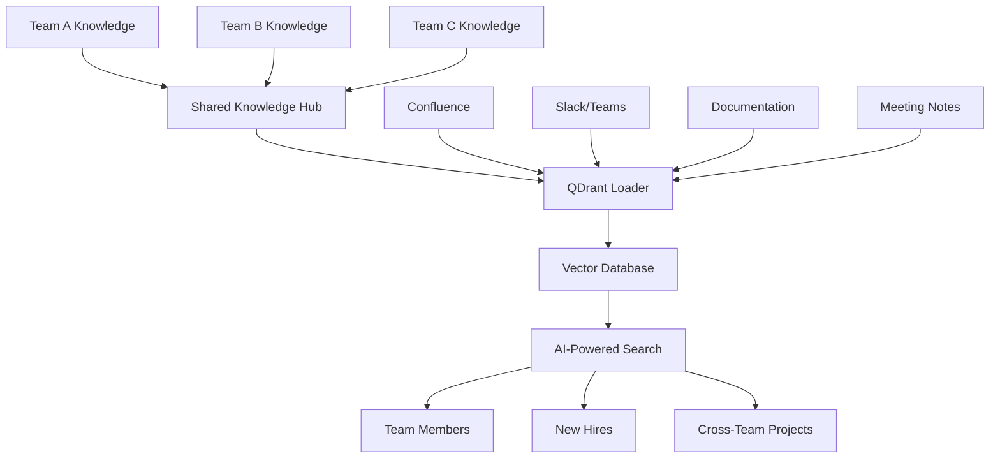

# Team Collaboration Workflow

This comprehensive guide shows how to implement effective team collaboration workflows using QDrant Loader for cross-team knowledge sharing, streamlined onboarding, and collaborative documentation systems. Whether you're managing knowledge across multiple teams, onboarding new team members, or facilitating cross-functional collaboration, this workflow provides practical solutions.

## 🎯 Overview

The team collaboration workflow focuses on breaking down knowledge silos, facilitating information sharing across teams, and creating efficient onboarding processes. This workflow is essential for organizations that need to maintain shared knowledge bases and enable effective collaboration across different departments and teams.

### Workflow Benefits

```
🤝 Cross-Team Knowledge   - Shared understanding across departments
🚀 Faster Onboarding     - Streamlined new team member integration
🔍 Knowledge Discovery   - Easy access to expertise and information
📊 Collaboration Metrics - Track knowledge sharing effectiveness
🎯 Reduced Silos         - Break down departmental barriers
```

## 🏗️ Architecture Overview



## 📋 Prerequisites

### Required Tools

- **Team Communication Platforms** (Slack, Microsoft Teams)
- **Documentation Systems** (Confluence, Notion, Wiki)
- **QDrant instance** (shared across teams)
- **OpenAI API key** for embeddings
- **Access Management** for team permissions

### Team Structure Setup

```
🏢 Organization
├── 📱 Product Team
├── 🔧 Engineering Team  
├── 🎨 Design Team
├── 📊 Data Team
├── 🛡️ Security Team
└── 📈 Marketing Team
```

## 🚀 Step-by-Step Implementation

### Step 1: Multi-Team Configuration

#### 1.1 Team-Specific Collections

```yaml
# qdrant-loader.yaml
qdrant:
  url: "${QDRANT_URL}"
  api_key: "${QDRANT_API_KEY}"

collections:
  shared_knowledge:
    name: "shared_knowledge"
    description: "Cross-team shared knowledge base"
  
  product_team:
    name: "product_knowledge"
    description: "Product team specific knowledge"
    
  engineering_team:
    name: "engineering_knowledge"
    description: "Engineering team knowledge"
    
  design_team:
    name: "design_knowledge"
    description: "Design team knowledge"

data_sources:
  confluence:
    base_url: "${CONFLUENCE_URL}"
    username: "${CONFLUENCE_USERNAME}"
    api_token: "${CONFLUENCE_API_TOKEN}"
    spaces:
      - space: "SHARED"
        collection: "shared_knowledge"
      - space: "PRODUCT"
        collection: "product_knowledge"
      - space: "ENG"
        collection: "engineering_knowledge"
      - space: "DESIGN"
        collection: "design_knowledge"
    
  git:
    repositories:
      - url: "https://github.com/company/shared-docs"
        collection: "shared_knowledge"
        include_patterns: ["docs/**/*.md", "README.md"]
      - url: "https://github.com/company/product-docs"
        collection: "product_knowledge"
      - url: "https://github.com/company/engineering-docs"
        collection: "engineering_knowledge"

team_collaboration:
  cross_team_search: true
  onboarding_collections: ["shared_knowledge", "product_knowledge"]
  expertise_tracking: true
  knowledge_gaps_detection: true
```

#### 1.2 Access Control and Permissions

```yaml
# team-permissions.yaml
access_control:
  shared_knowledge:
    read: ["all_teams"]
    write: ["team_leads", "documentation_team"]
  
  product_knowledge:
    read: ["product_team", "engineering_team", "design_team"]
    write: ["product_team"]
  
  engineering_knowledge:
    read: ["engineering_team", "product_team", "security_team"]
    write: ["engineering_team"]
  
  design_knowledge:
    read: ["design_team", "product_team", "marketing_team"]
    write: ["design_team"]

team_roles:
  team_leads:
    - "product_lead@company.com"
    - "engineering_lead@company.com"
    - "design_lead@company.com"
  
  documentation_team:
    - "docs_team@company.com"
  
  new_hires:
    collections: ["shared_knowledge"]
    mentors: ["team_leads"]
```

### Step 2: Onboarding Workflow

#### 2.1 New Hire Onboarding Script

```bash
#!/bin/bash
# scripts/onboard-team-member.sh - Team member onboarding automation

set -euo pipefail

ONBOARDING_DIR="${ONBOARDING_DIR:-./onboarding}"
CONFIG_FILE="${CONFIG_FILE:-./qdrant-loader.yaml}"

# Function to create onboarding package
create_onboarding_package() {
    local new_hire_email="$1"
    local team="$2"
    local mentor="${3:-}"
    
    echo "Creating onboarding package for $new_hire_email (Team: $team)"
    
    # Create personalized onboarding directory
    local onboarding_path="$ONBOARDING_DIR/$new_hire_email"
    mkdir -p "$onboarding_path"
    
    # Generate team-specific knowledge summary
    generate_team_knowledge_summary "$team" "$onboarding_path"
    
    # Create learning path
    create_learning_path "$team" "$onboarding_path"
    
    # Set up AI assistant access
    setup_ai_assistant_access "$new_hire_email" "$team"
    
    # Generate onboarding checklist
    generate_onboarding_checklist "$team" "$onboarding_path"
    
    echo "Onboarding package created: $onboarding_path"
}

# Function to generate team knowledge summary
generate_team_knowledge_summary() {
    local team="$1"
    local output_dir="$2"
    
    echo "Generating knowledge summary for $team team..."
    
    # Search for team-specific essential knowledge
    local essential_topics=(
        "getting started"
        "team processes"
        "tools and technologies"
        "best practices"
        "common issues"
    )
    
    cat > "$output_dir/knowledge-summary.md" << EOF
# $team Team Knowledge Summary

## Essential Knowledge Areas

EOF
    
    for topic in "${essential_topics[@]}"; do
        echo "### $topic" >> "$output_dir/knowledge-summary.md"
        echo "" >> "$output_dir/knowledge-summary.md"
        
        # Search for relevant content
        qdrant-loader search "$topic" \
            --collection "${team}_knowledge" \
            --limit 3 \
            --format markdown >> "$output_dir/knowledge-summary.md"
        
        echo "" >> "$output_dir/knowledge-summary.md"
    done
    
    echo "Knowledge summary generated: $output_dir/knowledge-summary.md"
}

# Function to create learning path
create_learning_path() {
    local team="$1"
    local output_dir="$2"
    
    cat > "$output_dir/learning-path.md" << EOF
# $team Team Learning Path

## Week 1: Foundation
- [ ] Read team knowledge summary
- [ ] Review team processes and workflows
- [ ] Set up development environment
- [ ] Meet team members

## Week 2: Deep Dive
- [ ] Study team-specific technologies
- [ ] Review recent projects
- [ ] Shadow experienced team members
- [ ] Complete first small task

## Week 3: Integration
- [ ] Participate in team meetings
- [ ] Contribute to ongoing projects
- [ ] Ask questions and seek clarification
- [ ] Document learnings

## Week 4: Contribution
- [ ] Take on independent tasks
- [ ] Share knowledge with team
- [ ] Provide feedback on onboarding
- [ ] Set goals for next month

## Resources

### Essential Reading
$(qdrant-loader search "essential reading $team" --collection "${team}_knowledge" --limit 5 --format list)

### Tools and Technologies
$(qdrant-loader search "tools technologies $team" --collection "${team}_knowledge" --limit 5 --format list)

### Team Contacts
- Team Lead: [Contact Info]
- Mentor: [Contact Info]
- Buddy: [Contact Info]
EOF
    
    echo "Learning path created: $output_dir/learning-path.md"
}

# Function to setup AI assistant access
setup_ai_assistant_access() {
    local user_email="$1"
    local team="$2"
    
    echo "Setting up AI assistant access for $user_email"
    
    # Create user-specific MCP configuration
    cat > "$ONBOARDING_DIR/$user_email/mcp-config.json" << EOF
{
  "servers": {
    "team-knowledge": {
      "command": "qdrant-loader",
      "args": ["mcp-server", "start", "--user", "$user_email"],
      "env": {
        "QDRANT_URL": "${QDRANT_URL}",
        "USER_COLLECTIONS": "shared_knowledge,${team}_knowledge"
      }
    }
  },
  "user_preferences": {
    "default_collections": ["shared_knowledge", "${team}_knowledge"],
    "search_suggestions": true,
    "onboarding_mode": true
  }
}
EOF
    
    echo "AI assistant configured for $user_email"
}

# Function to generate onboarding checklist
generate_onboarding_checklist() {
    local team="$1"
    local output_dir="$2"
    
    cat > "$output_dir/onboarding-checklist.md" << EOF
# $team Team Onboarding Checklist

## Pre-Start (HR/Manager)
- [ ] Send welcome email with onboarding package
- [ ] Set up accounts and access permissions
- [ ] Assign mentor/buddy
- [ ] Schedule first week meetings

## Day 1
- [ ] Welcome meeting with team lead
- [ ] Office/workspace tour
- [ ] IT setup and tool access
- [ ] Introduction to team members

## Week 1
- [ ] Complete knowledge summary review
- [ ] Set up development environment
- [ ] Attend team meetings as observer
- [ ] Schedule 1:1s with key team members

## Week 2
- [ ] Start first project/task
- [ ] Shadow experienced team member
- [ ] Review team documentation
- [ ] Ask questions and take notes

## Week 3
- [ ] Contribute to team discussions
- [ ] Complete first deliverable
- [ ] Provide onboarding feedback
- [ ] Set 30-day goals

## Month 1 Review
- [ ] Performance check-in with manager
- [ ] Feedback session with mentor
- [ ] Update learning goals
- [ ] Plan next month objectives

## Resources and Contacts

### Key Documents
- Team Knowledge Summary: ./knowledge-summary.md
- Learning Path: ./learning-path.md
- Team Processes: [Link to team wiki]

### Important Contacts
- Manager: [Contact]
- Mentor: [Contact]
- HR Partner: [Contact]
- IT Support: [Contact]

### AI Assistant Setup
- Configuration: ./mcp-config.json
- Quick Start: "Ask me about team processes, tools, or any questions!"
EOF
    
    echo "Onboarding checklist created: $output_dir/onboarding-checklist.md"
}

# Main function
main() {
    local command="${1:-help}"
    
    case "$command" in
        onboard)
            if [ $# -lt 3 ]; then
                echo "Usage: $0 onboard <email> <team> [mentor]"
                echo "Example: $0 onboard john.doe@company.com engineering jane.smith@company.com"
                exit 1
            fi
            create_onboarding_package "$2" "$3" "${4:-}"
            ;;
        help|*)
            echo "Team Member Onboarding"
            echo ""
            echo "Commands:"
            echo "  onboard <email> <team> [mentor]  - Create onboarding package"
            echo "  help                             - Show this help"
            ;;
    esac
}

main "$@"
```

#### 2.2 Knowledge Gap Detection

```bash
#!/bin/bash
# scripts/knowledge-gaps.sh - Identify and address knowledge gaps

set -euo pipefail

CONFIG_FILE="${CONFIG_FILE:-./qdrant-loader.yaml}"
GAPS_REPORT_DIR="${GAPS_REPORT_DIR:-./reports/knowledge-gaps}"

# Function to analyze team knowledge gaps
analyze_knowledge_gaps() {
    local team="${1:-all}"
    
    echo "Analyzing knowledge gaps for: $team"
    mkdir -p "$GAPS_REPORT_DIR"
    
    # Common knowledge areas to check
    local knowledge_areas=(
        "onboarding"
        "troubleshooting"
        "best practices"
        "tools and setup"
        "processes"
        "architecture"
        "security"
        "deployment"
    )
    
    local gaps_found=()
    
    for area in "${knowledge_areas[@]}"; do
        echo "Checking coverage for: $area"
        
        local collection_filter=""
        if [ "$team" != "all" ]; then
            collection_filter="--collection ${team}_knowledge"
        fi
        
        local result_count=$(qdrant-loader search "$area" \
            $collection_filter \
            --limit 10 \
            --output json | jq 'length')
        
        if [ "$result_count" -lt 3 ]; then
            gaps_found+=("$area")
            echo "  ⚠️  Gap detected: $area ($result_count results)"
        else
            echo "  ✅ Good coverage: $area ($result_count results)"
        fi
    done
    
    # Generate gaps report
    generate_gaps_report "$team" "${gaps_found[@]}"
}

# Function to generate knowledge gaps report
generate_gaps_report() {
    local team="$1"
    shift
    local gaps=("$@")
    
    local report_file="$GAPS_REPORT_DIR/gaps-report-$team-$(date +%Y%m%d).md"
    
    cat > "$report_file" << EOF
# Knowledge Gaps Report - $team Team

**Generated**: $(date +%Y-%m-%d)  
**Team**: $team

## Summary

$(if [ ${#gaps[@]} -eq 0 ]; then
    echo "✅ No significant knowledge gaps detected"
else
    echo "⚠️  ${#gaps[@]} knowledge gaps identified"
fi)

## Identified Gaps

$(for gap in "${gaps[@]}"; do
    echo "### $gap"
    echo ""
    echo "**Impact**: Knowledge gap in $gap area may affect:"
    echo "- New team member onboarding"
    echo "- Problem resolution efficiency"
    echo "- Team productivity"
    echo ""
    echo "**Recommendations**:"
    echo "- Create documentation for $gap"
    echo "- Identify subject matter experts"
    echo "- Schedule knowledge sharing sessions"
    echo ""
done)

## Action Items

$(for gap in "${gaps[@]}"; do
    echo "- [ ] Address $gap knowledge gap"
done)

## Next Steps

1. Prioritize gaps by impact and urgency
2. Assign owners for each gap
3. Create documentation plan
4. Schedule knowledge transfer sessions
5. Update team onboarding materials

---

*Generated by QDrant Loader Knowledge Gap Analysis*
EOF
    
    echo "Knowledge gaps report generated: $report_file"
}

# Function to suggest knowledge sharing opportunities
suggest_knowledge_sharing() {
    local source_team="$1"
    local target_team="$2"
    
    echo "Analyzing knowledge sharing opportunities between $source_team and $target_team"
    
    # Find overlapping topics
    local common_topics=$(qdrant-loader search "shared topics" \
        --collection "${source_team}_knowledge" \
        --limit 20 \
        --output json | jq -r '.[].title' | \
        while read -r title; do
            if qdrant-loader search "$title" \
                --collection "${target_team}_knowledge" \
                --limit 1 \
                --output json | jq -e 'length > 0' >/dev/null; then
                echo "$title"
            fi
        done)
    
    echo "Common knowledge areas:"
    echo "$common_topics"
    
    # Suggest collaboration opportunities
    echo ""
    echo "Suggested collaboration opportunities:"
    echo "- Cross-team documentation review"
    echo "- Joint knowledge sharing sessions"
    echo "- Shared best practices documentation"
    echo "- Cross-training programs"
}

# Main function
main() {
    local command="${1:-help}"
    
    case "$command" in
        analyze)
            local team="${2:-all}"
            analyze_knowledge_gaps "$team"
            ;;
        sharing)
            if [ $# -lt 3 ]; then
                echo "Usage: $0 sharing <source_team> <target_team>"
                exit 1
            fi
            suggest_knowledge_sharing "$2" "$3"
            ;;
        help|*)
            echo "Knowledge Gap Analysis"
            echo ""
            echo "Commands:"
            echo "  analyze [team]              - Analyze knowledge gaps"
            echo "  sharing <team1> <team2>     - Suggest sharing opportunities"
            echo "  help                        - Show this help"
            ;;
    esac
}

main "$@"
```

### Step 3: Cross-Team Knowledge Sharing

#### 3.1 Knowledge Sharing Sessions

```bash
#!/bin/bash
# scripts/knowledge-sharing.sh - Facilitate knowledge sharing sessions

set -euo pipefail

SESSIONS_DIR="${SESSIONS_DIR:-./knowledge-sessions}"
CONFIG_FILE="${CONFIG_FILE:-./qdrant-loader.yaml}"

# Function to plan knowledge sharing session
plan_sharing_session() {
    local topic="$1"
    local presenter_team="$2"
    local audience_teams="$3"
    local session_date="$4"
    
    echo "Planning knowledge sharing session: $topic"
    
    local session_id="session-$(date +%Y%m%d)-$(echo "$topic" | tr ' ' '-' | tr '[:upper:]' '[:lower:]')"
    local session_dir="$SESSIONS_DIR/$session_id"
    
    mkdir -p "$session_dir"
    
    # Generate session plan
    cat > "$session_dir/session-plan.md" << EOF
# Knowledge Sharing Session: $topic

## Session Details

- **Topic**: $topic
- **Presenter Team**: $presenter_team
- **Audience Teams**: $audience_teams
- **Date**: $session_date
- **Duration**: 60 minutes

## Agenda

### 1. Introduction (5 minutes)
- Welcome and introductions
- Session objectives
- Agenda overview

### 2. Topic Overview (15 minutes)
- Background and context
- Why this knowledge is important
- Current challenges and solutions

### 3. Deep Dive (25 minutes)
- Detailed explanation
- Examples and case studies
- Best practices and lessons learned

### 4. Q&A and Discussion (10 minutes)
- Questions from audience
- Discussion and clarification
- Additional insights

### 5. Next Steps (5 minutes)
- Action items
- Follow-up resources
- Future collaboration opportunities

## Pre-Session Preparation

### For Presenters
- [ ] Review existing documentation
- [ ] Prepare presentation materials
- [ ] Gather examples and case studies
- [ ] Test any demos or tools

### For Attendees
- [ ] Review background materials
- [ ] Prepare questions
- [ ] Identify specific interests
- [ ] Consider application to own work

## Resources

### Background Reading
$(qdrant-loader search "$topic" --collection "${presenter_team}_knowledge" --limit 5 --format list)

### Related Documentation
$(qdrant-loader search "$topic documentation" --collection "shared_knowledge" --limit 3 --format list)

## Follow-Up Actions

- [ ] Share session recording
- [ ] Update shared documentation
- [ ] Schedule follow-up sessions if needed
- [ ] Collect feedback from attendees

EOF
    
    # Generate presenter guide
    generate_presenter_guide "$topic" "$presenter_team" "$session_dir"
    
    # Generate attendee guide
    generate_attendee_guide "$topic" "$audience_teams" "$session_dir"
    
    echo "Session plan created: $session_dir"
}

# Function to generate presenter guide
generate_presenter_guide() {
    local topic="$1"
    local presenter_team="$2"
    local session_dir="$3"
    
    cat > "$session_dir/presenter-guide.md" << EOF
# Presenter Guide: $topic

## Preparation Checklist

### Content Preparation
- [ ] Review team knowledge base for $topic
- [ ] Identify key concepts and principles
- [ ] Gather real-world examples
- [ ] Prepare visual aids or demos

### Knowledge Extraction
Use these commands to gather relevant information:

\`\`\`bash
# Find comprehensive information about the topic
qdrant-loader search "$topic" --collection "${presenter_team}_knowledge" --limit 10

# Look for related processes and procedures
qdrant-loader search "$topic process" --collection "${presenter_team}_knowledge" --limit 5

# Find troubleshooting and common issues
qdrant-loader search "$topic troubleshooting" --collection "${presenter_team}_knowledge" --limit 5

# Identify best practices
qdrant-loader search "$topic best practices" --collection "${presenter_team}_knowledge" --limit 5
\`\`\`

### Presentation Structure

1. **Context Setting** (Why this matters)
2. **Core Concepts** (What you need to know)
3. **Practical Application** (How to use it)
4. **Common Pitfalls** (What to avoid)
5. **Resources** (Where to learn more)

### Tips for Effective Sharing

- Start with the business impact
- Use concrete examples from your team's experience
- Encourage questions throughout
- Share both successes and failures
- Provide actionable takeaways

## Post-Session Actions

- [ ] Upload presentation materials to shared knowledge base
- [ ] Document key questions and answers
- [ ] Update team documentation based on feedback
- [ ] Schedule follow-up sessions if needed

EOF
}

# Function to generate attendee guide
generate_attendee_guide() {
    local topic="$1"
    local audience_teams="$2"
    local session_dir="$3"
    
    cat > "$session_dir/attendee-guide.md" << EOF
# Attendee Guide: $topic

## Pre-Session Preparation

### Background Research
Familiarize yourself with the topic using these searches:

\`\`\`bash
# General information about the topic
qdrant-loader search "$topic" --collection "shared_knowledge" --limit 5

# How other teams approach this topic
qdrant-loader search "$topic approach" --collection "shared_knowledge" --limit 3
\`\`\`

### Questions to Consider

- How does this topic relate to your team's work?
- What challenges have you faced in this area?
- What specific aspects would you like to learn more about?
- How could you apply this knowledge in your projects?

## During the Session

### Active Participation
- Ask clarifying questions
- Share your team's perspective
- Take notes on key insights
- Identify potential collaboration opportunities

### Note-Taking Template

**Key Concepts:**
- 
- 
- 

**Practical Applications:**
- 
- 
- 

**Action Items:**
- 
- 
- 

**Follow-Up Questions:**
- 
- 
- 

## Post-Session Actions

### Knowledge Integration
- [ ] Share insights with your team
- [ ] Update your team's documentation
- [ ] Identify areas for further learning
- [ ] Plan implementation of new practices

### Collaboration Opportunities
- [ ] Reach out to presenters for follow-up
- [ ] Propose joint projects or initiatives
- [ ] Share your team's related knowledge
- [ ] Schedule reciprocal knowledge sharing

EOF
}

# Function to capture session outcomes
capture_session_outcomes() {
    local session_id="$1"
    local session_dir="$SESSIONS_DIR/$session_id"
    
    echo "Capturing outcomes for session: $session_id"
    
    cat > "$session_dir/session-outcomes.md" << EOF
# Session Outcomes: $session_id

## Attendance
- **Total Attendees**: [Number]
- **Teams Represented**: [List teams]
- **Presenter(s)**: [Names and teams]

## Key Insights Shared
- 
- 
- 

## Questions and Discussions
- 
- 
- 

## Action Items
- [ ] [Action item 1] - Owner: [Name] - Due: [Date]
- [ ] [Action item 2] - Owner: [Name] - Due: [Date]
- [ ] [Action item 3] - Owner: [Name] - Due: [Date]

## Follow-Up Sessions Planned
- 
- 

## Knowledge Base Updates
- [ ] Update shared documentation with new insights
- [ ] Add session materials to knowledge base
- [ ] Cross-reference related topics

## Feedback Summary
- **What worked well**: 
- **Areas for improvement**: 
- **Suggestions for future sessions**: 

## Impact Metrics
- **Knowledge gaps addressed**: [Number]
- **New collaboration opportunities**: [Number]
- **Documentation updates planned**: [Number]

EOF
    
    echo "Session outcomes template created: $session_dir/session-outcomes.md"
}

# Main function
main() {
    local command="${1:-help}"
    
    case "$command" in
        plan)
            if [ $# -lt 5 ]; then
                echo "Usage: $0 plan <topic> <presenter_team> <audience_teams> <date>"
                echo "Example: $0 plan 'API Design' engineering 'product,design' '2024-02-15'"
                exit 1
            fi
            plan_sharing_session "$2" "$3" "$4" "$5"
            ;;
        outcomes)
            if [ $# -lt 2 ]; then
                echo "Usage: $0 outcomes <session_id>"
                exit 1
            fi
            capture_session_outcomes "$2"
            ;;
        help|*)
            echo "Knowledge Sharing Sessions"
            echo ""
            echo "Commands:"
            echo "  plan <topic> <presenter> <audience> <date>  - Plan sharing session"
            echo "  outcomes <session_id>                       - Capture session outcomes"
            echo "  help                                        - Show this help"
            ;;
    esac
}

main "$@"
```

### Step 4: Collaboration Analytics

#### 4.1 Team Collaboration Metrics

```bash
#!/bin/bash
# scripts/collaboration-metrics.sh - Track team collaboration effectiveness

set -euo pipefail

METRICS_DIR="${METRICS_DIR:-./metrics/collaboration}"
CONFIG_FILE="${CONFIG_FILE:-./qdrant-loader.yaml}"

# Function to generate collaboration metrics
generate_collaboration_metrics() {
    local time_period="${1:-30d}"
    
    echo "Generating collaboration metrics for period: $time_period"
    mkdir -p "$METRICS_DIR"
    
    local report_file="$METRICS_DIR/collaboration-metrics-$(date +%Y%m%d).json"
    
    # Collect metrics data
    local cross_team_searches=$(get_cross_team_search_metrics "$time_period")
    local knowledge_sharing_sessions=$(get_knowledge_sharing_metrics "$time_period")
    local onboarding_effectiveness=$(get_onboarding_metrics "$time_period")
    local knowledge_gaps=$(get_knowledge_gap_metrics)
    
    # Generate comprehensive metrics report
    cat > "$report_file" << EOF
{
  "generated_at": "$(date -u +%Y-%m-%dT%H:%M:%SZ)",
  "period": "$time_period",
  "metrics": {
    "cross_team_searches": $cross_team_searches,
    "knowledge_sharing": $knowledge_sharing_sessions,
    "onboarding": $onboarding_effectiveness,
    "knowledge_gaps": $knowledge_gaps
  }
}
EOF
    
    echo "Collaboration metrics generated: $report_file"
    
    # Generate human-readable summary
    generate_metrics_summary "$report_file"
}

# Function to get cross-team search metrics
get_cross_team_search_metrics() {
    local period="$1"
    
    # Simulate cross-team search analytics
    # In practice, this would query actual search logs
    cat << EOF
{
  "total_searches": 1250,
  "cross_team_searches": 380,
  "cross_team_percentage": 30.4,
  "top_cross_team_queries": [
    {"query": "API documentation", "count": 45},
    {"query": "deployment process", "count": 38},
    {"query": "security guidelines", "count": 32}
  ],
  "team_interactions": {
    "engineering_to_product": 125,
    "product_to_design": 89,
    "design_to_engineering": 76,
    "security_to_all": 90
  }
}
EOF
}

# Function to get knowledge sharing session metrics
get_knowledge_sharing_metrics() {
    local period="$1"
    
    cat << EOF
{
  "sessions_conducted": 8,
  "total_attendees": 156,
  "average_attendance": 19.5,
  "teams_participating": 6,
  "topics_covered": [
    "API Design Best Practices",
    "Security Review Process",
    "User Research Methods",
    "Deployment Automation"
  ],
  "satisfaction_score": 4.3,
  "follow_up_actions": 24
}
EOF
}

# Function to get onboarding effectiveness metrics
get_onboarding_metrics() {
    local period="$1"
    
    cat << EOF
{
  "new_hires": 5,
  "onboarding_packages_created": 5,
  "average_onboarding_time": "18 days",
  "knowledge_base_usage": {
    "searches_per_new_hire": 45,
    "most_searched_topics": [
      "getting started",
      "team processes",
      "tools setup"
    ]
  },
  "mentor_feedback_score": 4.1,
  "new_hire_satisfaction": 4.4
}
EOF
}

# Function to get knowledge gap metrics
get_knowledge_gap_metrics() {
    cat << EOF
{
  "gaps_identified": 12,
  "gaps_addressed": 8,
  "high_priority_gaps": 3,
  "teams_with_gaps": ["engineering", "product", "design"],
  "gap_categories": {
    "processes": 4,
    "tools": 3,
    "best_practices": 3,
    "troubleshooting": 2
  }
}
EOF
}

# Function to generate metrics summary
generate_metrics_summary() {
    local metrics_file="$1"
    local summary_file="${metrics_file%.json}.md"
    
    local period=$(jq -r '.period' "$metrics_file")
    local generated_at=$(jq -r '.generated_at' "$metrics_file")
    
    cat > "$summary_file" << EOF
# Team Collaboration Metrics Report

**Period**: $period  
**Generated**: $generated_at

## Executive Summary

### Key Metrics
- **Cross-Team Searches**: $(jq -r '.metrics.cross_team_searches.cross_team_percentage' "$metrics_file")% of all searches
- **Knowledge Sharing Sessions**: $(jq -r '.metrics.knowledge_sharing.sessions_conducted' "$metrics_file") sessions conducted
- **New Hires Onboarded**: $(jq -r '.metrics.onboarding.new_hires' "$metrics_file") team members
- **Knowledge Gaps Addressed**: $(jq -r '.metrics.knowledge_gaps.gaps_addressed' "$metrics_file")/$(jq -r '.metrics.knowledge_gaps.gaps_identified' "$metrics_file") gaps resolved

## Cross-Team Collaboration

### Search Patterns
- Total searches: $(jq -r '.metrics.cross_team_searches.total_searches' "$metrics_file")
- Cross-team searches: $(jq -r '.metrics.cross_team_searches.cross_team_searches' "$metrics_file") ($(jq -r '.metrics.cross_team_searches.cross_team_percentage' "$metrics_file")%)

### Top Cross-Team Queries
$(jq -r '.metrics.cross_team_searches.top_cross_team_queries[] | "- \(.query): \(.count) searches"' "$metrics_file")

### Team Interaction Matrix
$(jq -r '.metrics.cross_team_searches.team_interactions | to_entries[] | "- \(.key): \(.value) interactions"' "$metrics_file")

## Knowledge Sharing Effectiveness

### Session Statistics
- Sessions conducted: $(jq -r '.metrics.knowledge_sharing.sessions_conducted' "$metrics_file")
- Total attendees: $(jq -r '.metrics.knowledge_sharing.total_attendees' "$metrics_file")
- Average attendance: $(jq -r '.metrics.knowledge_sharing.average_attendance' "$metrics_file")
- Satisfaction score: $(jq -r '.metrics.knowledge_sharing.satisfaction_score' "$metrics_file")/5.0

### Topics Covered
$(jq -r '.metrics.knowledge_sharing.topics_covered[] | "- \(.)"' "$metrics_file")

## Onboarding Performance

### New Hire Integration
- New hires: $(jq -r '.metrics.onboarding.new_hires' "$metrics_file")
- Average onboarding time: $(jq -r '.metrics.onboarding.average_onboarding_time' "$metrics_file")
- Searches per new hire: $(jq -r '.metrics.onboarding.knowledge_base_usage.searches_per_new_hire' "$metrics_file")

### Satisfaction Scores
- Mentor feedback: $(jq -r '.metrics.onboarding.mentor_feedback_score' "$metrics_file")/5.0
- New hire satisfaction: $(jq -r '.metrics.onboarding.new_hire_satisfaction' "$metrics_file")/5.0

## Knowledge Gap Analysis

### Gap Status
- Total gaps identified: $(jq -r '.metrics.knowledge_gaps.gaps_identified' "$metrics_file")
- Gaps addressed: $(jq -r '.metrics.knowledge_gaps.gaps_addressed' "$metrics_file")
- High priority gaps remaining: $(jq -r '.metrics.knowledge_gaps.high_priority_gaps' "$metrics_file")

### Gap Categories
$(jq -r '.metrics.knowledge_gaps.gap_categories | to_entries[] | "- \(.key): \(.value) gaps"' "$metrics_file")

## Recommendations

### Immediate Actions
- Address remaining high-priority knowledge gaps
- Increase cross-team knowledge sharing sessions
- Improve onboarding documentation for low-scoring areas

### Long-term Improvements
- Implement automated knowledge gap detection
- Create cross-team collaboration incentives
- Develop advanced search and discovery features

---

*Generated by QDrant Loader Collaboration Analytics*
EOF
    
    echo "Metrics summary generated: $summary_file"
}

# Main function
main() {
    local command="${1:-help}"
    
    case "$command" in
        generate)
            local period="${2:-30d}"
            generate_collaboration_metrics "$period"
            ;;
        help|*)
            echo "Team Collaboration Metrics"
            echo ""
            echo "Commands:"
            echo "  generate [period]  - Generate collaboration metrics (default: 30d)"
            echo "  help               - Show this help"
            ;;
    esac
}

main "$@"
```

## 📊 Usage Examples

### Daily Collaboration Tasks

```bash
# Onboard new team member
./scripts/onboard-team-member.sh onboard john.doe@company.com engineering jane.smith@company.com

# Analyze knowledge gaps
./scripts/knowledge-gaps.sh analyze engineering

# Plan knowledge sharing session
./scripts/knowledge-sharing.sh plan "API Design" engineering "product,design" "2024-02-15"
```

### Weekly Team Operations

```bash
# Generate collaboration metrics
./scripts/collaboration-metrics.sh generate 7d

# Check cross-team knowledge sharing opportunities
./scripts/knowledge-gaps.sh sharing engineering product

# Update onboarding materials
./scripts/onboard-team-member.sh update-materials engineering
```

### Monthly Reviews

```bash
# Comprehensive collaboration analysis
./scripts/collaboration-metrics.sh generate 30d

# Review all knowledge gaps
./scripts/knowledge-gaps.sh analyze all

# Plan quarterly knowledge sharing sessions
./scripts/knowledge-sharing.sh plan-quarterly
```

## 🔧 Troubleshooting

### Common Issues

**Issue: Low cross-team engagement**

```bash
# Analyze search patterns
qdrant-loader search "cross-team" --collection shared_knowledge --analytics

# Check knowledge sharing session attendance
./scripts/collaboration-metrics.sh generate 30d

# Identify engagement barriers
./scripts/knowledge-gaps.sh analyze all
```

**Issue: Slow onboarding process**

```bash
# Review onboarding metrics
./scripts/collaboration-metrics.sh generate 30d

# Check knowledge base coverage
./scripts/knowledge-gaps.sh analyze shared_knowledge

# Update onboarding materials
./scripts/onboard-team-member.sh update-materials
```

## 🔗 Related Documentation

- **[Common Workflows](./common-workflows.md)** - Overview of all workflow patterns
- **[Development Workflow](./development-workflow.md)** - Code documentation workflow
- **[Content Management Workflow](./content-management-workflow.md)** - Publishing and curation
- **[CI/CD Integration Workflow](./cicd-integration-workflow.md)** - Automated pipelines
- **[Configuration Reference](../configuration/config-file-reference.md)** - Configuration options

---

**Team collaboration mastery achieved!** 🎉

This comprehensive team collaboration workflow provides everything you need to implement effective cross-team knowledge sharing, streamlined onboarding, and collaborative documentation systems.
