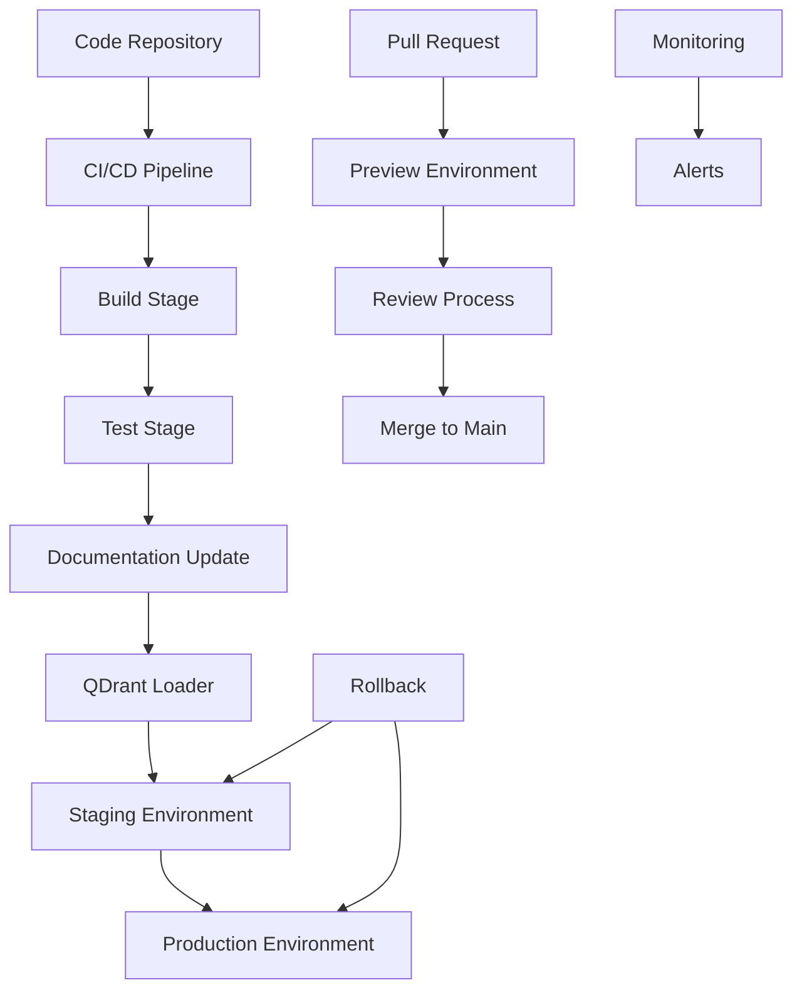

# CI/CD Integration Workflow

This comprehensive guide shows how to implement automated documentation pipelines and continuous knowledge base updates using QDrant Loader in CI/CD environments. Whether you're setting up automated documentation deployment, multi-environment knowledge bases, or continuous integration for documentation, this workflow provides practical solutions for modern DevOps practices.

## 🎯 Overview

The CI/CD integration workflow focuses on automating documentation processes, ensuring knowledge bases stay current with code changes, and implementing robust deployment pipelines for documentation systems. This workflow is essential for teams that want to maintain up-to-date documentation without manual intervention.

### Workflow Benefits

```
🔄 Automated Updates      - Documentation stays current with code
🚀 Continuous Deployment  - Seamless multi-environment deployments
🔍 Quality Assurance      - Automated testing and validation
📊 Pipeline Monitoring    - Track deployment success and performance
🛡️ Rollback Capabilities  - Safe deployment with quick recovery
```

## 🏗️ Architecture Overview



## 📋 Prerequisites

### Required Tools

- **CI/CD Platform** (GitHub Actions, GitLab CI, Jenkins)
- **Container Registry** (Docker Hub, ECR, GCR)
- **QDrant instances** (staging and production)
- **Monitoring tools** (Prometheus, Grafana)
- **Secret management** (Vault, CI/CD secrets)

### Infrastructure Setup

```
🏗️ Infrastructure
├── 🔧 Development Environment
├── 🧪 Staging Environment
├── 🚀 Production Environment
└── 📊 Monitoring & Logging
```

## 🚀 Step-by-Step Implementation

### Step 1: Pipeline Configuration

#### 1.1 GitHub Actions Pipeline

```yaml
# .github/workflows/documentation-pipeline.yml
name: Documentation CI/CD Pipeline

on:
  push:
    branches: [main, develop]
    paths: ['docs/**', 'src/**', '*.md']
  pull_request:
    branches: [main]
    paths: ['docs/**', 'src/**', '*.md']
  schedule:
    - cron: '0 2 * * *'  # Daily at 2 AM UTC

env:
  REGISTRY: ghcr.io
  IMAGE_NAME: ${{ github.repository }}/qdrant-loader

jobs:
  detect-changes:
    runs-on: ubuntu-latest
    outputs:
      docs-changed: ${{ steps.changes.outputs.docs }}
      code-changed: ${{ steps.changes.outputs.code }}
      config-changed: ${{ steps.changes.outputs.config }}
    steps:
    - uses: actions/checkout@v4
    - uses: dorny/paths-filter@v2
      id: changes
      with:
        filters: |
          docs:
            - 'docs/**'
            - '*.md'
          code:
            - 'src/**'
            - 'api/**'
          config:
            - 'qdrant-loader.yaml'
            - '.github/workflows/**'

  validate-configuration:
    runs-on: ubuntu-latest
    needs: detect-changes
    if: needs.detect-changes.outputs.config-changed == 'true'
    steps:
    - uses: actions/checkout@v4
    - name: Setup Python
      uses: actions/setup-python@v4
      with:
        python-version: '3.11'
    - name: Install QDrant Loader
      run: pip install qdrant-loader
    - name: Validate configuration
      run: qdrant-loader config validate
    - name: Test connections
      env:
        QDRANT_URL: ${{ secrets.QDRANT_STAGING_URL }}
        QDRANT_API_KEY: ${{ secrets.QDRANT_STAGING_API_KEY }}
        OPENAI_API_KEY: ${{ secrets.OPENAI_API_KEY }}
      run: qdrant-loader config test --connections qdrant,openai

  build-and-test:
    runs-on: ubuntu-latest
    needs: [detect-changes, validate-configuration]
    if: always() && (needs.detect-changes.outputs.docs-changed == 'true' || needs.detect-changes.outputs.code-changed == 'true')
    steps:
    - uses: actions/checkout@v4
      with:
        fetch-depth: 0
    
    - name: Setup Python
      uses: actions/setup-python@v4
      with:
        python-version: '3.11'
    
    - name: Install dependencies
      run: |
        pip install qdrant-loader
        pip install pytest pytest-cov
    
    - name: Run documentation tests
      run: |
        # Test documentation quality
        python scripts/test-docs-quality.py
        
        # Test configuration validity
        qdrant-loader config validate
        
        # Test sample data loading
        qdrant-loader load --source local --path ./test-data --dry-run
    
    - name: Build documentation metrics
      run: |
        python scripts/generate-docs-metrics.py
    
    - name: Upload test results
      uses: actions/upload-artifact@v3
      with:
        name: test-results
        path: test-results/

  deploy-staging:
    runs-on: ubuntu-latest
    needs: [detect-changes, build-and-test]
    if: github.ref == 'refs/heads/develop' || github.ref == 'refs/heads/main'
    environment: staging
    steps:
    - uses: actions/checkout@v4
    
    - name: Setup Python
      uses: actions/setup-python@v4
      with:
        python-version: '3.11'
    
    - name: Install QDrant Loader
      run: pip install qdrant-loader
    
    - name: Deploy to staging
      env:
        QDRANT_URL: ${{ secrets.QDRANT_STAGING_URL }}
        QDRANT_API_KEY: ${{ secrets.QDRANT_STAGING_API_KEY }}
        OPENAI_API_KEY: ${{ secrets.OPENAI_API_KEY }}
      run: |
        # Update staging environment
        qdrant-loader update --source git --collection docs_staging
        
        # Verify deployment
        qdrant-loader status --collection docs_staging --detailed
    
    - name: Run staging tests
      env:
        QDRANT_URL: ${{ secrets.QDRANT_STAGING_URL }}
        QDRANT_API_KEY: ${{ secrets.QDRANT_STAGING_API_KEY }}
        OPENAI_API_KEY: ${{ secrets.OPENAI_API_KEY }}
      run: |
        python scripts/test-staging-deployment.py
    
    - name: Generate staging report
      run: |
        qdrant-loader status --collection docs_staging --output json > staging-report.json
    
    - name: Upload staging report
      uses: actions/upload-artifact@v3
      with:
        name: staging-report
        path: staging-report.json

  deploy-production:
    runs-on: ubuntu-latest
    needs: [deploy-staging]
    if: github.ref == 'refs/heads/main'
    environment: production
    steps:
    - uses: actions/checkout@v4
    
    - name: Setup Python
      uses: actions/setup-python@v4
      with:
        python-version: '3.11'
    
    - name: Install QDrant Loader
      run: pip install qdrant-loader
    
    - name: Backup production
      env:
        QDRANT_URL: ${{ secrets.QDRANT_PROD_URL }}
        QDRANT_API_KEY: ${{ secrets.QDRANT_PROD_API_KEY }}
      run: |
        qdrant-loader backup --collection docs_production --output production-backup-${{ github.sha }}.tar.gz
    
    - name: Deploy to production
      env:
        QDRANT_URL: ${{ secrets.QDRANT_PROD_URL }}
        QDRANT_API_KEY: ${{ secrets.QDRANT_PROD_API_KEY }}
        OPENAI_API_KEY: ${{ secrets.OPENAI_API_KEY }}
      run: |
        # Update production environment
        qdrant-loader update --source git --collection docs_production
        
        # Optimize after deployment
        qdrant-loader optimize --collection docs_production
    
    - name: Run production tests
      env:
        QDRANT_URL: ${{ secrets.QDRANT_PROD_URL }}
        QDRANT_API_KEY: ${{ secrets.QDRANT_PROD_API_KEY }}
        OPENAI_API_KEY: ${{ secrets.OPENAI_API_KEY }}
      run: |
        python scripts/test-production-deployment.py
    
    - name: Notify deployment
      uses: 8398a7/action-slack@v3
      with:
        status: success
        webhook_url: ${{ secrets.SLACK_WEBHOOK }}
        text: "Documentation successfully deployed to production"

  preview-environment:
    runs-on: ubuntu-latest
    if: github.event_name == 'pull_request'
    steps:
    - uses: actions/checkout@v4
    
    - name: Setup Python
      uses: actions/setup-python@v4
      with:
        python-version: '3.11'
    
    - name: Install QDrant Loader
      run: pip install qdrant-loader
    
    - name: Create preview environment
      env:
        QDRANT_URL: ${{ secrets.QDRANT_STAGING_URL }}
        QDRANT_API_KEY: ${{ secrets.QDRANT_STAGING_API_KEY }}
        OPENAI_API_KEY: ${{ secrets.OPENAI_API_KEY }}
      run: |
        # Create preview collection
        PREVIEW_COLLECTION="docs_preview_pr_${{ github.event.number }}"
        qdrant-loader load --source git --collection "$PREVIEW_COLLECTION"
        
        # Generate preview report
        echo "Preview environment created: $PREVIEW_COLLECTION" > preview-info.txt
        qdrant-loader status --collection "$PREVIEW_COLLECTION" >> preview-info.txt
    
    - name: Comment PR
      uses: actions/github-script@v6
      with:
        script: |
          const fs = require('fs');
          const previewInfo = fs.readFileSync('preview-info.txt', 'utf8');
          github.rest.issues.createComment({
            issue_number: context.issue.number,
            owner: context.repo.owner,
            repo: context.repo.repo,
            body: `## 📖 Documentation Preview\n\n\`\`\`\n${previewInfo}\n\`\`\``
          });
```

#### 1.2 GitLab CI Pipeline

```yaml
# .gitlab-ci.yml
stages:
  - validate
  - build
  - test
  - deploy-staging
  - deploy-production
  - cleanup

variables:
  PIP_CACHE_DIR: "$CI_PROJECT_DIR/.cache/pip"
  DOCKER_DRIVER: overlay2

cache:
  paths:
    - .cache/pip/

.qdrant_loader_setup: &qdrant_loader_setup
  - pip install qdrant-loader
  - qdrant-loader config validate

validate-config:
  stage: validate
  image: python:3.11
  script:
    - *qdrant_loader_setup
  only:
    changes:
      - qdrant-loader.yaml
      - .gitlab-ci.yml

build-and-test:
  stage: build
  image: python:3.11
  script:
    - *qdrant_loader_setup
    - python scripts/test-docs-quality.py
    - qdrant-loader load --source local --path ./test-data --dry-run
  artifacts:
    reports:
      junit: test-results/junit.xml
    paths:
      - test-results/
  only:
    changes:
      - docs/**/*
      - src/**/*
      - "*.md"

deploy-staging:
  stage: deploy-staging
  image: python:3.11
  script:
    - *qdrant_loader_setup
    - qdrant-loader update --source git --collection docs_staging
    - python scripts/test-staging-deployment.py
  environment:
    name: staging
    url: https://docs-staging.company.com
  only:
    - develop
    - main

deploy-production:
  stage: deploy-production
  image: python:3.11
  script:
    - *qdrant_loader_setup
    - qdrant-loader backup --collection docs_production --output backup-$CI_COMMIT_SHA.tar.gz
    - qdrant-loader update --source git --collection docs_production
    - qdrant-loader optimize --collection docs_production
    - python scripts/test-production-deployment.py
  environment:
    name: production
    url: https://docs.company.com
  when: manual
  only:
    - main

cleanup-preview:
  stage: cleanup
  image: python:3.11
  script:
    - *qdrant_loader_setup
    - |
      if [ "$CI_MERGE_REQUEST_ID" ]; then
        PREVIEW_COLLECTION="docs_preview_mr_$CI_MERGE_REQUEST_ID"
        qdrant-loader collection delete "$PREVIEW_COLLECTION" || true
      fi
  when: manual
  only:
    - merge_requests
```

### Step 2: Testing and Quality Assurance

#### 2.1 Documentation Quality Tests

```python
# scripts/test-docs-quality.py
#!/usr/bin/env python3
"""
Documentation quality testing script for CI/CD pipeline.
"""

import os
import sys
import json
import subprocess
from pathlib import Path
from typing import List, Dict, Any

class DocumentationTester:
    def __init__(self, docs_path: str = "docs"):
        self.docs_path = Path(docs_path)
        self.errors = []
        self.warnings = []
        
    def run_all_tests(self) -> bool:
        """Run all documentation quality tests."""
        print("🧪 Running documentation quality tests...")
        
        # Test markdown files
        self.test_markdown_quality()
        
        # Test links
        self.test_links()
        
        # Test configuration
        self.test_configuration()
        
        # Test content completeness
        self.test_content_completeness()
        
        # Generate report
        self.generate_report()
        
        return len(self.errors) == 0
    
    def test_markdown_quality(self):
        """Test markdown file quality."""
        print("📝 Testing markdown quality...")
        
        md_files = list(self.docs_path.rglob("*.md"))
        
        for md_file in md_files:
            # Check file size
            if md_file.stat().st_size == 0:
                self.errors.append(f"Empty file: {md_file}")
                continue
            
            # Check basic structure
            content = md_file.read_text(encoding='utf-8')
            
            if not content.startswith('#'):
                self.warnings.append(f"No main heading: {md_file}")
            
            # Check for common issues
            if '](http' in content:
                # Check for broken links (basic)
                import re
                links = re.findall(r'\[([^\]]+)\]\((http[^)]+)\)', content)
                for text, url in links:
                    if 'localhost' in url:
                        self.warnings.append(f"Localhost link in {md_file}: {url}")
    
    def test_links(self):
        """Test internal and external links."""
        print("🔗 Testing links...")
        
        # This would typically use a more sophisticated link checker
        # For now, we'll do basic validation
        md_files = list(self.docs_path.rglob("*.md"))
        
        for md_file in md_files:
            content = md_file.read_text(encoding='utf-8')
            
            # Check for relative links
            import re
            relative_links = re.findall(r'\[([^\]]+)\]\(([^http][^)]+)\)', content)
            
            for text, link in relative_links:
                if link.startswith('./') or link.startswith('../'):
                    target_path = (md_file.parent / link).resolve()
                    if not target_path.exists():
                        self.errors.append(f"Broken relative link in {md_file}: {link}")
    
    def test_configuration(self):
        """Test QDrant Loader configuration."""
        print("⚙️ Testing configuration...")
        
        try:
            result = subprocess.run(
                ['qdrant-loader', 'config', 'validate'],
                capture_output=True,
                text=True,
                check=True
            )
            print("✅ Configuration validation passed")
        except subprocess.CalledProcessError as e:
            self.errors.append(f"Configuration validation failed: {e.stderr}")
    
    def test_content_completeness(self):
        """Test content completeness."""
        print("📋 Testing content completeness...")
        
        required_files = [
            "README.md",
            "docs/getting-started/installation.md",
            "docs/getting-started/quick-start.md",
        ]
        
        for required_file in required_files:
            file_path = Path(required_file)
            if not file_path.exists():
                self.errors.append(f"Missing required file: {required_file}")
    
    def generate_report(self):
        """Generate test report."""
        report = {
            "timestamp": subprocess.check_output(['date', '-u', '+%Y-%m-%dT%H:%M:%SZ']).decode().strip(),
            "errors": self.errors,
            "warnings": self.warnings,
            "summary": {
                "total_errors": len(self.errors),
                "total_warnings": len(self.warnings),
                "status": "PASS" if len(self.errors) == 0 else "FAIL"
            }
        }
        
        # Create test results directory
        os.makedirs("test-results", exist_ok=True)
        
        # Write JSON report
        with open("test-results/docs-quality-report.json", "w") as f:
            json.dump(report, f, indent=2)
        
        # Write JUnit XML for CI integration
        self.write_junit_xml(report)
        
        # Print summary
        print(f"\n📊 Test Summary:")
        print(f"   Errors: {len(self.errors)}")
        print(f"   Warnings: {len(self.warnings)}")
        print(f"   Status: {report['summary']['status']}")
        
        if self.errors:
            print("\n❌ Errors:")
            for error in self.errors:
                print(f"   - {error}")
        
        if self.warnings:
            print("\n⚠️  Warnings:")
            for warning in self.warnings:
                print(f"   - {warning}")
    
    def write_junit_xml(self, report: Dict[str, Any]):
        """Write JUnit XML format for CI integration."""
        xml_content = f"""<?xml version="1.0" encoding="UTF-8"?>
<testsuite name="documentation-quality" tests="{len(self.errors) + len(self.warnings)}" failures="{len(self.errors)}" errors="0" time="0">
"""
        
        for error in self.errors:
            xml_content += f"""  <testcase name="{error}" classname="docs.quality">
    <failure message="{error}"/>
  </testcase>
"""
        
        for warning in self.warnings:
            xml_content += f"""  <testcase name="{warning}" classname="docs.quality">
  </testcase>
"""
        
        xml_content += "</testsuite>"
        
        with open("test-results/junit.xml", "w") as f:
            f.write(xml_content)

def main():
    """Main function."""
    tester = DocumentationTester()
    success = tester.run_all_tests()
    
    sys.exit(0 if success else 1)

if __name__ == "__main__":
    main()
```

#### 2.2 Staging Deployment Tests

```python
# scripts/test-staging-deployment.py
#!/usr/bin/env python3
"""
Staging deployment testing script.
"""

import os
import sys
import json
import subprocess
import time
from typing import List, Dict, Any

class StagingTester:
    def __init__(self):
        self.collection = "docs_staging"
        self.test_queries = [
            "getting started",
            "installation guide",
            "configuration",
            "troubleshooting",
            "API documentation"
        ]
        
    def run_tests(self) -> bool:
        """Run staging deployment tests."""
        print("🧪 Testing staging deployment...")
        
        success = True
        
        # Test collection status
        if not self.test_collection_status():
            success = False
        
        # Test search functionality
        if not self.test_search_functionality():
            success = False
        
        # Test MCP server
        if not self.test_mcp_server():
            success = False
        
        # Test performance
        if not self.test_performance():
            success = False
        
        return success
    
    def test_collection_status(self) -> bool:
        """Test collection status and health."""
        print("📊 Testing collection status...")
        
        try:
            result = subprocess.run(
                ['qdrant-loader', 'status', '--collection', self.collection, '--output', 'json'],
                capture_output=True,
                text=True,
                check=True
            )
            
            status = json.loads(result.stdout)
            vector_count = status.get('vector_count', 0)
            
            if vector_count == 0:
                print("❌ Collection is empty")
                return False
            
            print(f"✅ Collection has {vector_count} vectors")
            return True
            
        except subprocess.CalledProcessError as e:
            print(f"❌ Collection status check failed: {e.stderr}")
            return False
    
    def test_search_functionality(self) -> bool:
        """Test search functionality."""
        print("🔍 Testing search functionality...")
        
        success = True
        
        for query in self.test_queries:
            try:
                result = subprocess.run(
                    ['qdrant-loader', 'search', query, '--collection', self.collection, '--limit', '3', '--output', 'json'],
                    capture_output=True,
                    text=True,
                    check=True,
                    timeout=10
                )
                
                results = json.loads(result.stdout)
                
                if len(results) == 0:
                    print(f"⚠️  No results for query: {query}")
                else:
                    print(f"✅ Query '{query}': {len(results)} results")
                
            except subprocess.CalledProcessError as e:
                print(f"❌ Search failed for '{query}': {e.stderr}")
                success = False
            except subprocess.TimeoutExpired:
                print(f"❌ Search timeout for '{query}'")
                success = False
        
        return success
    
    def test_mcp_server(self) -> bool:
        """Test MCP server functionality."""
        print("🔌 Testing MCP server...")
        
        try:
            # Start MCP server in background
            server_process = subprocess.Popen(
                ['qdrant-loader', 'mcp-server', 'start', '--port', '8080', '--daemon'],
                stdout=subprocess.PIPE,
                stderr=subprocess.PIPE
            )
            
            # Wait for server to start
            time.sleep(5)
            
            # Test server status
            result = subprocess.run(
                ['qdrant-loader', 'mcp-server', 'status'],
                capture_output=True,
                text=True,
                check=True
            )
            
            print("✅ MCP server is running")
            
            # Stop server
            subprocess.run(['qdrant-loader', 'mcp-server', 'stop'], check=True)
            
            return True
            
        except subprocess.CalledProcessError as e:
            print(f"❌ MCP server test failed: {e.stderr}")
            return False
    
    def test_performance(self) -> bool:
        """Test performance metrics."""
        print("⚡ Testing performance...")
        
        try:
            start_time = time.time()
            
            result = subprocess.run(
                ['qdrant-loader', 'search', 'performance test', '--collection', self.collection, '--limit', '5'],
                capture_output=True,
                text=True,
                check=True
            )
            
            end_time = time.time()
            duration = end_time - start_time
            
            if duration > 5.0:  # 5 second threshold
                print(f"⚠️  Search is slow: {duration:.2f}s")
                return False
            
            print(f"✅ Search performance: {duration:.2f}s")
            return True
            
        except subprocess.CalledProcessError as e:
            print(f"❌ Performance test failed: {e.stderr}")
            return False

def main():
    """Main function."""
    tester = StagingTester()
    success = tester.run_tests()
    
    if success:
        print("\n🎉 All staging tests passed!")
    else:
        print("\n💥 Some staging tests failed!")
    
    sys.exit(0 if success else 1)

if __name__ == "__main__":
    main()
```

### Step 3: Multi-Environment Management

#### 3.1 Environment Configuration

```yaml
# environments/staging.yaml
environment: staging

qdrant:
  url: "${QDRANT_STAGING_URL}"
  api_key: "${QDRANT_STAGING_API_KEY}"
  collection_name: "docs_staging"

openai:
  api_key: "${OPENAI_API_KEY}"
  model: "text-embedding-3-small"

processing:
  chunk_size: 1000
  chunk_overlap: 200
  parallel_workers: 4

monitoring:
  enabled: true
  metrics_endpoint: "https://metrics-staging.company.com"
  log_level: "DEBUG"

---
# environments/production.yaml
environment: production

qdrant:
  url: "${QDRANT_PROD_URL}"
  api_key: "${QDRANT_PROD_API_KEY}"
  collection_name: "docs_production"

openai:
  api_key: "${OPENAI_API_KEY}"
  model: "text-embedding-3-small"

processing:
  chunk_size: 1200
  chunk_overlap: 300
  parallel_workers: 8
  optimize_after_load: true

monitoring:
  enabled: true
  metrics_endpoint: "https://metrics.company.com"
  log_level: "INFO"

backup:
  enabled: true
  schedule: "0 2 * * *"  # Daily at 2 AM
  retention_days: 30
```

#### 3.2 Deployment Scripts

```bash
#!/bin/bash
# scripts/deploy-environment.sh - Environment deployment automation

set -euo pipefail

ENVIRONMENT="${1:-staging}"
CONFIG_FILE="environments/${ENVIRONMENT}.yaml"
BACKUP_DIR="backups/${ENVIRONMENT}"

# Function to deploy to environment
deploy_environment() {
    local env="$1"
    
    echo "🚀 Deploying to $env environment..."
    
    # Validate environment configuration
    if [ ! -f "$CONFIG_FILE" ]; then
        echo "❌ Configuration file not found: $CONFIG_FILE"
        exit 1
    fi
    
    # Validate configuration
    qdrant-loader config validate --config "$CONFIG_FILE"
    
    # Create backup if production
    if [ "$env" = "production" ]; then
        create_backup "$env"
    fi
    
    # Deploy documentation
    deploy_documentation "$env"
    
    # Run post-deployment tests
    run_deployment_tests "$env"
    
    # Update monitoring
    update_monitoring "$env"
    
    echo "✅ Deployment to $env completed successfully"
}

# Function to create backup
create_backup() {
    local env="$1"
    
    echo "💾 Creating backup for $env..."
    
    mkdir -p "$BACKUP_DIR"
    
    local backup_file="$BACKUP_DIR/backup-$(date +%Y%m%d-%H%M%S).tar.gz"
    
    qdrant-loader backup \
        --config "$CONFIG_FILE" \
        --output "$backup_file"
    
    echo "✅ Backup created: $backup_file"
}

# Function to deploy documentation
deploy_documentation() {
    local env="$1"
    
    echo "📚 Deploying documentation to $env..."
    
    # Update documentation
    qdrant-loader update \
        --source git \
        --config "$CONFIG_FILE" \
        --progress
    
    # Optimize collection if production
    if [ "$env" = "production" ]; then
        qdrant-loader optimize \
            --config "$CONFIG_FILE"
    fi
}

# Function to run deployment tests
run_deployment_tests() {
    local env="$1"
    
    echo "🧪 Running deployment tests for $env..."
    
    if [ "$env" = "staging" ]; then
        python scripts/test-staging-deployment.py
    elif [ "$env" = "production" ]; then
        python scripts/test-production-deployment.py
    fi
}

# Function to update monitoring
update_monitoring() {
    local env="$1"
    
    echo "📊 Updating monitoring for $env..."
    
    # Update deployment metrics
    local deployment_info=$(qdrant-loader status \
        --config "$CONFIG_FILE" \
        --output json)
    
    # Send metrics to monitoring system
    curl -X POST \
        -H "Content-Type: application/json" \
        -d "$deployment_info" \
        "$(yq eval '.monitoring.metrics_endpoint' "$CONFIG_FILE")/deployment" || true
}

# Function to rollback deployment
rollback_deployment() {
    local env="$1"
    local backup_file="$2"
    
    echo "🔄 Rolling back $env deployment..."
    
    if [ ! -f "$backup_file" ]; then
        echo "❌ Backup file not found: $backup_file"
        exit 1
    fi
    
    # Restore from backup
    qdrant-loader collection restore \
        --input "$backup_file" \
        --config "$CONFIG_FILE" \
        --force
    
    # Verify rollback
    run_deployment_tests "$env"
    
    echo "✅ Rollback completed successfully"
}

# Main function
main() {
    local command="${1:-deploy}"
    
    case "$command" in
        deploy)
            local env="${2:-staging}"
            deploy_environment "$env"
            ;;
        rollback)
            if [ $# -lt 3 ]; then
                echo "Usage: $0 rollback <environment> <backup_file>"
                exit 1
            fi
            rollback_deployment "$2" "$3"
            ;;
        test)
            local env="${2:-staging}"
            run_deployment_tests "$env"
            ;;
        help|*)
            echo "Environment Deployment"
            echo ""
            echo "Commands:"
            echo "  deploy <environment>           - Deploy to environment"
            echo "  rollback <env> <backup_file>   - Rollback deployment"
            echo "  test <environment>             - Run deployment tests"
            echo "  help                           - Show this help"
            ;;
    esac
}

main "$@"
```

## 📊 Usage Examples

### Daily CI/CD Operations

```bash
# Manual deployment to staging
./scripts/deploy-environment.sh deploy staging

# Test staging deployment
./scripts/deploy-environment.sh test staging

# Deploy to production
./scripts/deploy-environment.sh deploy production
```

### Pipeline Monitoring

```bash
# Check pipeline status
gh workflow list

# View pipeline logs
gh run view --log

# Monitor deployment metrics
curl -s https://metrics.company.com/deployment | jq
```

### Emergency Procedures

```bash
# Rollback production deployment
./scripts/deploy-environment.sh rollback production backups/production/backup-20240115-143022.tar.gz

# Check system health
qdrant-loader status --config environments/production.yaml --detailed

# Emergency maintenance mode
qdrant-loader mcp-server stop
```

## 🔧 Troubleshooting

### Common Pipeline Issues

**Issue: Pipeline fails on configuration validation**

```bash
# Check configuration locally
qdrant-loader config validate --config environments/staging.yaml

# Test connections
qdrant-loader config test --connections qdrant,openai --config environments/staging.yaml
```

**Issue: Deployment timeout**

```bash
# Check QDrant instance health
curl -s "$QDRANT_URL/health"

# Monitor deployment progress
qdrant-loader status --collection docs_staging --watch
```

**Issue: Tests fail after deployment**

```bash
# Run tests locally
python scripts/test-staging-deployment.py

# Check search functionality
qdrant-loader search "test query" --collection docs_staging --limit 3
```

## 🔗 Related Documentation

- **[Common Workflows](./common-workflows.md)** - Overview of all workflow patterns
- **[Development Workflow](./development-workflow.md)** - Code documentation workflow
- **[Content Management Workflow](./content-management-workflow.md)** - Publishing and curation
- **[Team Collaboration Workflow](./team-collaboration-workflow.md)** - Cross-team knowledge sharing
- **[Configuration Reference](../configuration/config-file-reference.md)** - Configuration options

---

**CI/CD integration mastery achieved!** 🎉

This comprehensive CI/CD integration workflow provides everything you need to implement automated documentation pipelines, multi-environment deployments, and continuous knowledge base updates.
