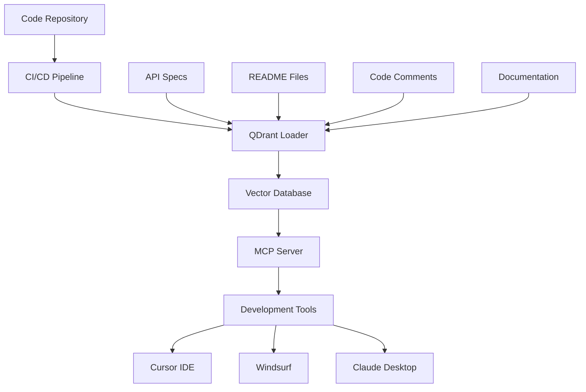

# Development Workflow

This comprehensive guide shows how to implement automated documentation workflows for development teams. Whether you're maintaining code documentation, API references, or development guides, this workflow provides step-by-step instructions for creating a seamless, automated documentation system.

## 🎯 Overview

The development workflow focuses on keeping documentation synchronized with code changes, providing developers with up-to-date information, and integrating documentation into the development process. This workflow is essential for maintaining high-quality, current documentation in fast-moving development environments.

### Workflow Benefits

```
🔄 Automated Updates     - Documentation stays current with code
🚀 Developer Productivity - Faster access to relevant information
🔍 Better Discoverability - AI-powered search for code and docs
📈 Reduced Maintenance   - Minimal manual documentation overhead
🤝 Team Collaboration   - Shared knowledge base across teams
```

## 🏗️ Architecture Overview



## 📋 Prerequisites

### Required Tools

- **Git repository** with documentation
- **CI/CD platform** (GitHub Actions, GitLab CI, etc.)
- **QDrant instance** (local or cloud)
- **OpenAI API key** for embeddings
- **Development IDE** (Cursor, Windsurf, VS Code)

### Repository Structure

```
project/
├── docs/                    # Documentation files
│   ├── api/                # API documentation
│   ├── guides/             # Development guides
│   └── README.md           # Main documentation
├── src/                    # Source code
│   ├── components/         # Code with comments
│   └── api/               # API definitions
├── .github/workflows/      # CI/CD workflows
├── qdrant-loader.yaml     # QDrant Loader config
└── README.md              # Project overview
```

## 🚀 Step-by-Step Implementation

### Step 1: Repository Setup

#### 1.1 Initialize QDrant Loader Configuration

```bash
# Navigate to your project root
cd /path/to/your/project

# Initialize QDrant Loader
qdrant-loader init --template development

# This creates qdrant-loader.yaml with development-friendly defaults
```

#### 1.2 Configure Data Sources

```yaml
# qdrant-loader.yaml
qdrant:
  url: "${QDRANT_URL}"
  api_key: "${QDRANT_API_KEY}"
  collection_name: "dev_docs"

openai:
  api_key: "${OPENAI_API_KEY}"
  model: "text-embedding-3-small"

data_sources:
  git:
    repositories:
      - url: "."  # Current repository
        branch: "main"
        include_patterns:
          - "docs/**/*.md"
          - "README.md"
          - "src/**/*.py"
          - "src/**/*.js"
          - "src/**/*.ts"
          - "api/**/*.yaml"
          - "api/**/*.json"
        exclude_patterns:
          - "node_modules/"
          - "__pycache__/"
          - ".git/"
          - "*.log"

processing:
  chunk_size: 1000
  chunk_overlap: 200
  extract_code_comments: true
  include_file_metadata: true

mcp_server:
  port: 8080
  host: "localhost"
```

#### 1.3 Set Up Environment Variables

```bash
# .env file (for local development)
QDRANT_URL=http://localhost:6333
QDRANT_API_KEY=your-qdrant-api-key
OPENAI_API_KEY=your-openai-api-key

# For production, use your CI/CD platform's secret management
```

### Step 2: Local Development Setup

#### 2.1 Install and Configure QDrant Loader

```bash
# Install QDrant Loader
pip install qdrant-loader

# Validate configuration
qdrant-loader config validate

# Test connections
qdrant-loader config test --connections qdrant,openai
```

#### 2.2 Initial Data Load

```bash
# Load documentation for the first time
qdrant-loader load --source git --progress

# Verify the load
qdrant-loader status --detailed

# Start MCP server for development
qdrant-loader mcp-server start --dev
```

#### 2.3 Configure Development IDE

**For Cursor IDE:**

```json
// .cursor/settings.json
{
  "mcp.servers": {
    "qdrant-loader": {
      "command": "qdrant-loader",
      "args": ["mcp-server", "start", "--port", "8080"],
      "env": {
        "QDRANT_URL": "http://localhost:6333",
        "OPENAI_API_KEY": "your-api-key"
      }
    }
  }
}
```

**For VS Code with MCP extension:**

```json
// .vscode/settings.json
{
  "mcp.servers": [
    {
      "name": "qdrant-loader",
      "command": "qdrant-loader mcp-server start --port 8080"
    }
  ]
}
```

### Step 3: CI/CD Integration

#### 3.1 GitHub Actions Workflow

```yaml
# .github/workflows/update-docs.yml
name: Update Documentation

on:
  push:
    branches: [main, develop]
    paths:
      - 'docs/**'
      - 'src/**'
      - 'api/**'
      - 'README.md'
  pull_request:
    branches: [main]
  schedule:
    # Update daily at 2 AM UTC
    - cron: '0 2 * * *'

jobs:
  update-documentation:
    runs-on: ubuntu-latest
    
    steps:
    - name: Checkout repository
      uses: actions/checkout@v4
      with:
        fetch-depth: 0  # Full history for better change detection
    
    - name: Setup Python
      uses: actions/setup-python@v4
      with:
        python-version: '3.11'
    
    - name: Install QDrant Loader
      run: |
        pip install qdrant-loader
    
    - name: Validate configuration
      run: |
        qdrant-loader config validate
    
    - name: Update documentation
      env:
        QDRANT_URL: ${{ secrets.QDRANT_URL }}
        QDRANT_API_KEY: ${{ secrets.QDRANT_API_KEY }}
        OPENAI_API_KEY: ${{ secrets.OPENAI_API_KEY }}
      run: |
        # Check for changes first
        if qdrant-loader status --check-changes --source git; then
          echo "Changes detected, updating documentation..."
          
          # Update with progress tracking
          qdrant-loader update --source git --progress
          
          # Optimize after update
          qdrant-loader optimize --collection dev_docs
          
          # Verify update
          qdrant-loader status --detailed
        else
          echo "No changes detected, skipping update"
        fi
    
    - name: Test search functionality
      env:
        QDRANT_URL: ${{ secrets.QDRANT_URL }}
        QDRANT_API_KEY: ${{ secrets.QDRANT_API_KEY }}
        OPENAI_API_KEY: ${{ secrets.OPENAI_API_KEY }}
      run: |
        # Test basic search
        qdrant-loader search "API documentation" --limit 3
        
        # Test code search
        qdrant-loader search "authentication function" --limit 3
    
    - name: Generate documentation report
      run: |
        # Create a report of what was updated
        qdrant-loader status --recent --limit 10 --output json > update-report.json
        
        # Display summary
        echo "Documentation update completed:"
        qdrant-loader status --collections --stats
    
    - name: Upload report
      uses: actions/upload-artifact@v3
      with:
        name: documentation-report
        path: update-report.json
    
    - name: Notify on failure
      if: failure()
      uses: 8398a7/action-slack@v3
      with:
        status: failure
        webhook_url: ${{ secrets.SLACK_WEBHOOK }}
        text: "Documentation update failed for ${{ github.repository }}"
```

#### 3.2 GitLab CI Configuration

```yaml
# .gitlab-ci.yml
stages:
  - validate
  - update
  - test

variables:
  PIP_CACHE_DIR: "$CI_PROJECT_DIR/.cache/pip"

cache:
  paths:
    - .cache/pip/

validate-docs-config:
  stage: validate
  image: python:3.11
  script:
    - pip install qdrant-loader
    - qdrant-loader config validate
  only:
    changes:
      - qdrant-loader.yaml
      - docs/**/*
      - src/**/*

update-documentation:
  stage: update
  image: python:3.11
  script:
    - pip install qdrant-loader
    - |
      if qdrant-loader status --check-changes --source git; then
        qdrant-loader update --source git --progress
        qdrant-loader optimize --collection dev_docs
      fi
  only:
    - main
    - develop
  environment:
    name: documentation
    url: https://docs.company.com

test-search:
  stage: test
  image: python:3.11
  script:
    - pip install qdrant-loader
    - qdrant-loader search "API" --limit 5
    - qdrant-loader search "installation" --limit 5
  only:
    - main
```

### Step 4: Advanced Configuration

#### 4.1 Multi-Environment Setup

```yaml
# configs/development.yaml
qdrant:
  url: "http://localhost:6333"
  collection_name: "dev_docs_dev"

processing:
  chunk_size: 800  # Smaller chunks for development
  parallel_workers: 2

mcp_server:
  port: 8080
  debug: true

---
# configs/staging.yaml
qdrant:
  url: "${QDRANT_STAGING_URL}"
  collection_name: "dev_docs_staging"

processing:
  chunk_size: 1000
  parallel_workers: 4

---
# configs/production.yaml
qdrant:
  url: "${QDRANT_PROD_URL}"
  collection_name: "dev_docs_prod"

processing:
  chunk_size: 1200  # Larger chunks for production
  parallel_workers: 8
  optimize_after_load: true

mcp_server:
  port: 8080
  debug: false
```

#### 4.2 Code Comment Extraction

```python
# src/utils/auth.py
"""
Authentication utilities for the application.

This module provides functions for user authentication,
token validation, and session management.
"""

def authenticate_user(username: str, password: str) -> bool:
    """
    Authenticate a user with username and password.
    
    Args:
        username: The user's username
        password: The user's password
        
    Returns:
        True if authentication successful, False otherwise
        
    Example:
        >>> authenticate_user("john_doe", "secure_password")
        True
    """
    # Implementation here
    pass

def validate_token(token: str) -> dict:
    """
    Validate a JWT token and return user information.
    
    Args:
        token: JWT token string
        
    Returns:
        Dictionary containing user information if valid
        
    Raises:
        TokenExpiredError: If token has expired
        InvalidTokenError: If token is invalid
    """
    # Implementation here
    pass
```

#### 4.3 API Documentation Integration

```yaml
# api/openapi.yaml
openapi: 3.0.0
info:
  title: Development API
  description: |
    This API provides endpoints for the development application.
    
    ## Authentication
    All endpoints require authentication via JWT token.
    
    ## Rate Limiting
    API calls are limited to 1000 requests per hour per user.
  version: 1.0.0

paths:
  /auth/login:
    post:
      summary: User login
      description: |
        Authenticate a user and return a JWT token.
        
        The token should be included in subsequent requests
        in the Authorization header as "Bearer {token}".
      requestBody:
        required: true
        content:
          application/json:
            schema:
              type: object
              properties:
                username:
                  type: string
                  description: User's username
                password:
                  type: string
                  description: User's password
      responses:
        '200':
          description: Login successful
          content:
            application/json:
              schema:
                type: object
                properties:
                  token:
                    type: string
                    description: JWT authentication token
                  expires_in:
                    type: integer
                    description: Token expiration time in seconds
```

### Step 5: Development Team Integration

#### 5.1 Team Onboarding Script

```bash
#!/bin/bash
# scripts/setup-dev-docs.sh - Team member onboarding

set -euo pipefail

echo "Setting up development documentation system..."

# Check prerequisites
if ! command -v python3 &> /dev/null; then
    echo "Error: Python 3 is required"
    exit 1
fi

if ! command -v git &> /dev/null; then
    echo "Error: Git is required"
    exit 1
fi

# Install QDrant Loader
echo "Installing QDrant Loader..."
pip install qdrant-loader

# Validate configuration
echo "Validating configuration..."
if ! qdrant-loader config validate; then
    echo "Error: Configuration validation failed"
    echo "Please check your environment variables and qdrant-loader.yaml"
    exit 1
fi

# Load initial documentation
echo "Loading documentation..."
qdrant-loader load --source git --progress

# Start MCP server
echo "Starting MCP server..."
qdrant-loader mcp-server start --daemon

echo "Setup complete! You can now:"
echo "1. Search documentation: qdrant-loader search 'your query'"
echo "2. Use AI tools with integrated documentation"
echo "3. Update docs: qdrant-loader update --source git"

# Test search
echo "Testing search functionality..."
qdrant-loader search "getting started" --limit 3
```

#### 5.2 IDE Integration Guide

**Cursor IDE Setup:**

1. **Install MCP Extension** (if not built-in)
2. **Configure Server:**

   ```json
   {
     "mcp.servers": {
       "dev-docs": {
         "command": "qdrant-loader",
         "args": ["mcp-server", "start"],
         "env": {
           "QDRANT_URL": "http://localhost:6333"
         }
       }
     }
   }
   ```

3. **Usage Examples:**
   - Ask: "How do I authenticate users in this codebase?"
   - Ask: "Show me examples of API error handling"
   - Ask: "What's the deployment process for this project?"

**VS Code Setup:**

1. **Install MCP Extension**
2. **Configure Workspace:**

   ```json
   {
     "mcp.servers": [
       {
         "name": "dev-docs",
         "command": "qdrant-loader mcp-server start --port 8080"
       }
     ]
   }
   ```

### Step 6: Monitoring and Maintenance

#### 6.1 Health Monitoring Script

```bash
#!/bin/bash
# scripts/monitor-docs.sh - Documentation health monitoring

set -euo pipefail

LOG_FILE="/var/log/dev-docs-monitor.log"

log() {
    echo "[$(date '+%Y-%m-%d %H:%M:%S')] $1" | tee -a "$LOG_FILE"
}

# Check documentation freshness
check_freshness() {
    log "Checking documentation freshness..."
    
    local last_update
    last_update=$(qdrant-loader status --recent --limit 1 --output json | jq -r '.[0].timestamp // empty')
    
    if [ -z "$last_update" ]; then
        log "WARNING: No recent updates found"
        return 1
    fi
    
    local update_age
    update_age=$(( $(date +%s) - $(date -d "$last_update" +%s) ))
    
    # Alert if documentation is older than 24 hours
    if [ "$update_age" -gt 86400 ]; then
        log "WARNING: Documentation is stale (last update: $last_update)"
        return 1
    fi
    
    log "Documentation freshness OK (last update: $last_update)"
    return 0
}

# Check search performance
check_search_performance() {
    log "Checking search performance..."
    
    local start_time=$(date +%s%N)
    qdrant-loader search "API documentation" --limit 5 --quiet > /dev/null
    local end_time=$(date +%s%N)
    
    local duration=$(( (end_time - start_time) / 1000000 ))  # Convert to milliseconds
    
    if [ "$duration" -gt 2000 ]; then  # 2 seconds threshold
        log "WARNING: Search is slow (${duration}ms)"
        return 1
    fi
    
    log "Search performance OK (${duration}ms)"
    return 0
}

# Check collection health
check_collection_health() {
    log "Checking collection health..."
    
    local stats
    stats=$(qdrant-loader status --collections --stats --output json)
    
    local vector_count
    vector_count=$(echo "$stats" | jq -r '.[0].vector_count // 0')
    
    if [ "$vector_count" -eq 0 ]; then
        log "ERROR: Collection is empty"
        return 1
    fi
    
    log "Collection health OK ($vector_count vectors)"
    return 0
}

# Main monitoring function
main() {
    log "Starting documentation monitoring"
    
    local failed_checks=()
    
    if ! check_freshness; then
        failed_checks+=("freshness")
    fi
    
    if ! check_search_performance; then
        failed_checks+=("search_performance")
    fi
    
    if ! check_collection_health; then
        failed_checks+=("collection_health")
    fi
    
    if [ ${#failed_checks[@]} -eq 0 ]; then
        log "All checks passed"
        exit 0
    else
        log "Failed checks: $(IFS=', '; echo "${failed_checks[*]}")"
        exit 1
    fi
}

main "$@"
```

#### 6.2 Automated Optimization

```bash
#!/bin/bash
# scripts/optimize-docs.sh - Weekly optimization

set -euo pipefail

echo "Starting weekly documentation optimization..."

# Backup before optimization
echo "Creating backup..."
qdrant-loader backup --output "backup-$(date +%Y%m%d).tar.gz"

# Clean up old data
echo "Cleaning up old data..."
qdrant-loader clean --temp --logs --older-than 7d

# Optimize collections
echo "Optimizing collections..."
qdrant-loader optimize --all

# Update statistics
echo "Updating statistics..."
qdrant-loader collection stats --all --update

# Verify optimization
echo "Verifying optimization..."
qdrant-loader status --detailed

echo "Optimization completed successfully"
```

## 📊 Usage Examples

### Daily Development Tasks

```bash
# Update documentation after code changes
qdrant-loader update --source git

# Search for specific functionality
qdrant-loader search "authentication middleware" --limit 5

# Find API endpoints
qdrant-loader search "POST /api/users" --type keyword

# Look for code examples
qdrant-loader search "error handling examples" --snippets
```

### Code Review Integration

```bash
# Before code review - update docs
qdrant-loader update --source git --modified-only

# During review - search for related documentation
qdrant-loader search "similar implementation" --filter "type:code"

# After review - verify documentation is current
qdrant-loader status --check-changes
```

### API Development

```bash
# Load API specifications
qdrant-loader load --source git --include "api/**/*.yaml"

# Search for API patterns
qdrant-loader search "authentication endpoint" --filter "source:api"

# Find usage examples
qdrant-loader search "API client example" --snippets --limit 3
```

## 🔧 Troubleshooting

### Common Issues

**Issue: Documentation not updating**

```bash
# Check for changes
qdrant-loader status --check-changes --source git

# Force update
qdrant-loader update --source git --force

# Check logs
qdrant-loader logs --level ERROR --since 1h
```

**Issue: Search results not relevant**

```bash
# Check collection status
qdrant-loader status --collections --stats

# Optimize collection
qdrant-loader optimize --collection dev_docs

# Test with different search types
qdrant-loader search "query" --type semantic
qdrant-loader search "query" --type keyword
```

**Issue: MCP server not responding**

```bash
# Check server status
qdrant-loader mcp-server status

# Restart server
qdrant-loader mcp-server restart

# Check logs
qdrant-loader mcp-server logs --tail 50
```

### Performance Optimization

```bash
# Monitor performance
qdrant-loader metrics --metric search_latency,memory_usage

# Optimize for speed
qdrant-loader config set processing.chunk_size 800
qdrant-loader config set processing.parallel_workers 8

# Optimize for accuracy
qdrant-loader config set processing.chunk_size 1200
qdrant-loader config set processing.chunk_overlap 300
```

## 🔗 Related Documentation

- **[Common Workflows](./common-workflows.md)** - Overview of all workflow patterns
- **[Content Management Workflow](./content-management-workflow.md)** - Publishing and curation
- **[CI/CD Integration Workflow](./cicd-integration-workflow.md)** - Automated pipelines
- **[CLI Reference](../cli-reference/commands.md)** - Complete command documentation
- **[Configuration Reference](../configuration/config-file-reference.md)** - Configuration options

---

**Development workflow mastery achieved!** 🎉

This comprehensive development workflow provides everything you need to implement automated, AI-powered documentation systems that keep pace with your development process and enhance developer productivity.
